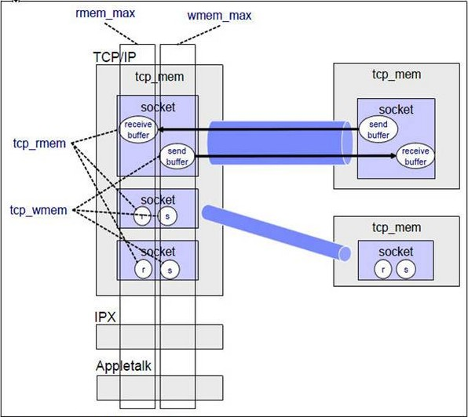

# TCP相关的Linux内核参数

所有的TCP/IP参数都位于/proc/sys/net目录下（请注意，对/proc/sys/net目录下内容的修改都是临时的，任何修改在系统重启后都会丢失），例如下面这些重要的参数：

<table border="1" cellspacing="0" cellpadding="0">
<tbody>
<tr>
<td width="314">
<p align="center"><strong>参数（路径</strong><strong>+</strong><strong>文件）</strong></p>
</td>
<td width="449">
<p align="center"><strong>描述</strong></p>
</td>
<td width="212">
<p align="center"><strong>默认值</strong></p>
</td>
<td width="225">
<p align="center"><strong>优化值</strong></p>
</td>
</tr>
<tr>
<td width="314">
<p>/proc/sys/net/core/rmem_default</p>
</td>
<td width="449">
<p align="left">默认的TCP数据接收窗口大小（字节）。</p>
</td>
<td width="212">
<p align="center">229376</p>
</td>
<td width="225">
<p align="center">256960</p>
</td>
</tr>
<tr>
<td width="314">
<p>/proc/sys/net/core/rmem_max</p>
</td>
<td width="449">
<p>最大的TCP数据接收窗口（字节）。</p>
</td>
<td width="212">
<p align="center">131071</p>
</td>
<td width="225">
<p align="center">513920</p>
</td>
</tr>
<tr>
<td width="314">
<p>/proc/sys/net/core/wmem_default</p>
</td>
<td width="449">
<p>默认的TCP数据发送窗口大小（字节）。</p>
</td>
<td width="212">
<p align="center">229376</p>
</td>
<td width="225">
<p align="center">256960</p>
</td>
</tr>
<tr>
<td width="314">
<p>/proc/sys/net/core/wmem_max</p>
</td>
<td width="449">
<p>最大的TCP数据发送窗口（字节）。</p>
</td>
<td width="212">
<p align="center">131071</p>
</td>
<td width="225">
<p align="center">513920</p>
</td>
</tr>
<tr>
<td width="314">
<p>/proc/sys/net/core/netdev_max_backlog</p>
</td>
<td width="449">
<p>在每个网络接口接收数据包的速率比内核处理这些包的速率快时，允许送到队列的数据包的最大数目。</p>
</td>
<td width="212">
<p align="center">1000</p>
</td>
<td width="225">
<p align="center">2000</p>
</td>
</tr>
<tr>
<td width="314">
<p>/proc/sys/net/core/somaxconn</p>
</td>
<td width="449">
<p>定义了系统中每一个端口最大的监听队列的长度，这是个全局的参数。</p>
</td>
<td width="212">
<p align="center">128</p>
</td>
<td width="225">
<p align="center">2048</p>
</td>
</tr>
<tr>
<td width="314">
<p>/proc/sys/net/core/optmem_max</p>
</td>
<td width="449">
<p>表示每个套接字所允许的最大缓冲区的大小。</p>
</td>
<td width="212">
<p align="center">20480</p>
</td>
<td width="225">
<p align="center">81920</p>
</td>
</tr>
<tr>
<td width="314">
<p>/proc/sys/net/ipv4/tcp_mem</p>
</td>
<td width="449">
<p>确定TCP栈应该如何反映内存使用，每个值的单位都是内存页（通常是4KB）。第一个值是内存使用的下限；第二个值是内存压力模式开始对缓冲区使用应用压力的上限；第三个值是内存使用的上限。在这个层次上可以将报文丢弃，从而减少对内存的使用。对于较大的BDP可以增大这些值（注意，其单位是内存页而不是字节）。</p>
</td>
<td width="212">
<p align="center">94011&nbsp; 125351&nbsp; 188022</p>
</td>
<td width="225">
<p align="center">131072&nbsp; 262144&nbsp; 524288</p>
</td>
</tr>
<tr>
<td width="314">
<p>/proc/sys/net/ipv4/tcp_rmem</p>
</td>
<td width="449">
<p>为自动调优定义socket使用的内存。第一个值是为socket接收缓冲区分配的最少字节数；第二个值是默认值（该值会被rmem_default覆盖），缓冲区在系统负载不重的情况下可以增长到这个值；第三个值是接收缓冲区空间的最大字节数（该值会被rmem_max覆盖）。</p>
</td>
<td width="212">
<p align="center">4096&nbsp; 87380&nbsp; 4011232</p>
</td>
<td width="225">
<p align="center">8760&nbsp; 256960&nbsp; 4088000</p>
</td>
</tr>
<tr>
<td width="314">
<p>/proc/sys/net/ipv4/tcp_wmem</p>
</td>
<td width="449">
<p>为自动调优定义socket使用的内存。第一个值是为socket发送缓冲区分配的最少字节数；第二个值是默认值（该值会被wmem_default覆盖），缓冲区在系统负载不重的情况下可以增长到这个值；第三个值是发送缓冲区空间的最大字节数（该值会被wmem_max覆盖）。</p>
</td>
<td width="212">
<p align="center">4096&nbsp; 16384&nbsp; 4011232</p>
</td>
<td width="225">
<p align="center">8760&nbsp; 256960&nbsp; 4088000</p>
</td>
</tr>
<tr>
<td width="314">
<p>/proc/sys/net/ipv4/tcp_keepalive_time</p>
</td>
<td width="449">
<p>TCP发送keepalive探测消息的间隔时间（秒），用于确认TCP连接是否有效。</p>
</td>
<td width="212">
<p align="center">7200</p>
</td>
<td width="225">
<p align="center">1800</p>
</td>
</tr>
<tr>
<td width="314">
<p>/proc/sys/net/ipv4/tcp_keepalive_intvl</p>
</td>
<td width="449">
<p>探测消息未获得响应时，重发该消息的间隔时间（秒）。</p>
</td>
<td width="212">
<p align="center">75</p>
</td>
<td width="225">
<p align="center">30</p>
</td>
</tr>
<tr>
<td width="314">
<p>/proc/sys/net/ipv4/tcp_keepalive_probes</p>
</td>
<td width="449">
<p>在认定TCP连接失效之前，最多发送多少个keepalive探测消息。</p>
</td>
<td width="212">
<p align="center">9</p>
</td>
<td width="225">
<p align="center">3</p>
</td>
</tr>
<tr>
<td width="314">
<p>/proc/sys/net/ipv4/tcp_sack</p>
</td>
<td width="449">
<p>启用有选择的应答（1表示启用），通过有选择地应答乱序接收到的报文来提高性能，让发送者只发送丢失的报文段，（对于广域网通信来说）这个选项应该启用，但是会增加对CPU的占用。</p>
</td>
<td width="212">
<p align="center">1</p>
</td>
<td width="225">
<p align="center">1</p>
</td>
</tr>
<tr>
<td width="314">
<p>/proc/sys/net/ipv4/tcp_fack</p>
</td>
<td width="449">
<p>启用转发应答，可以进行有选择应答（SACK）从而减少拥塞情况的发生，这个选项也应该启用。</p>
</td>
<td width="212">
<p align="center">1</p>
</td>
<td width="225">
<p align="center">1</p>
</td>
</tr>
<tr>
<td width="314">
<p>/proc/sys/net/ipv4/tcp_timestamps</p>
</td>
<td width="449">
<p>TCP时间戳（会在TCP包头增加12个字节），以一种比重发超时更精确的方法（参考RFC 1323）来启用对RTT 的计算，为实现更好的性能应该启用这个选项。</p>
</td>
<td width="212">
<p align="center">1</p>
</td>
<td width="225">
<p align="center">1</p>
</td>
</tr>
<tr>
<td width="314">
<p>/proc/sys/net/ipv4/tcp_window_scaling</p>
</td>
<td width="449">
<p>启用RFC 1323定义的window scaling，要支持超过64KB的TCP窗口，必须启用该值（1表示启用），TCP窗口最大至1GB，TCP连接双方都启用时才生效。</p>
</td>
<td width="212">
<p align="center">1</p>
</td>
<td width="225">
<p align="center">1</p>
</td>
</tr>
<tr>
<td width="314">
<p>/proc/sys/net/ipv4/tcp_syncookies</p>
</td>
<td width="449">
<p>表示是否打开TCP同步标签（syncookie），内核必须打开了CONFIG_SYN_COOKIES项进行编译，同步标签可以防止一个套接字在有过多试图连接到达时引起过载。</p>
</td>
<td width="212">
<p align="center">1</p>
</td>
<td width="225">
<p align="center">1</p>
</td>
</tr>
<tr>
<td width="314">
<p>/proc/sys/net/ipv4/tcp_tw_reuse</p>
</td>
<td width="449">
<p>表示是否允许将处于TIME-WAIT状态的socket（TIME-WAIT的端口）用于新的TCP连接 。</p>
</td>
<td width="212">
<p align="center">0</p>
</td>
<td width="225">
<p align="center">1</p>
</td>
</tr>
<tr>
<td width="314">
<p>/proc/sys/net/ipv4/tcp_tw_recycle</p>
</td>
<td width="449">
<p>能够更快地回收TIME-WAIT套接字。</p>
</td>
<td width="212">
<p align="center">0</p>
</td>
<td width="225">
<p align="center">1</p>
</td>
</tr>
<tr>
<td width="314">
<p>/proc/sys/net/ipv4/tcp_fin_timeout</p>
</td>
<td width="449">
<p>对于本端断开的socket连接，TCP保持在FIN-WAIT-2状态的时间（秒）。对方可能会断开连接或一直不结束连接或不可预料的进程死亡。</p>
</td>
<td width="212">
<p align="center">60</p>
</td>
<td width="225">
<p align="center">30</p>
</td>
</tr>
<tr>
<td width="314">
<p>/proc/sys/net/ipv4/ip_local_port_range</p>
</td>
<td width="449">
<p>表示TCP/UDP协议允许使用的本地端口号</p>
</td>
<td width="212">
<p align="center">32768&nbsp; 61000</p>
</td>
<td width="225">
<p align="center">1024&nbsp; 65000</p>
</td>
</tr>
<tr>
<td width="314">
<p>/proc/sys/net/ipv4/tcp_max_syn_backlog</p>
</td>
<td width="449">
<p>对于还未获得对方确认的连接请求，可保存在队列中的最大数目。如果服务器经常出现过载，可以尝试增加这个数字。</p>
</td>
<td width="212">
<p align="center">2048</p>
</td>
<td width="225">
<p align="center">2048</p>
</td>
</tr>
<tr>
<td width="314">
<p>/proc/sys/net/ipv4/tcp_low_latency</p>
</td>
<td width="449">
<p>允许TCP/IP栈适应在高吞吐量情况下低延时的情况，这个选项应该禁用。</p>
</td>
<td width="212">
<p align="center">0</p>
</td>
<td width="225">
<p align="center">&nbsp;</p>
</td>
</tr>
<tr>
<td width="314">
<p>/proc/sys/net/ipv4/tcp_westwood</p>
</td>
<td width="449">
<p>启用发送者端的拥塞控制算法，它可以维护对吞吐量的评估，并试图对带宽的整体利用情况进行优化，对于WAN 通信来说应该启用这个选项。</p>
</td>
<td width="212">
<p align="center">0</p>
</td>
<td width="225">
<p align="center">&nbsp;</p>
</td>
</tr>
<tr>
<td width="314">
<p>/proc/sys/net/ipv4/tcp_bic</p>
</td>
<td width="449">
<p>为快速长距离网络启用Binary Increase Congestion，这样可以更好地利用以GB速度进行操作的链接，对于WAN通信应该启用这个选项。</p>
</td>
<td width="212">
<p align="center">1</p>
</td>
<td width="225">
<p align="center">&nbsp;</p>
</td>
</tr>
</tbody>
</table>

## /etc/sysctl.conf文件

/etc/sysctl.conf是一个允许你改变正在运行中的Linux系统的接口。它包含一些TCP/IP堆栈和虚拟内存系统的高级选项，可用来控制Linux网络配置，由于/proc/sys/net目录内容的临时性，建议把TCPIP参数的修改添加到/etc/sysctl.conf文件, 然后保存文件，使用命令“/sbin/sysctl –p”使之立即生效。

具体修改方案参照上文：

```shell
net.core.rmem_default = 256960
net.core.rmem_max = 513920
net.core.wmem_default = 256960
net.core.wmem_max = 513920
net.core.netdev_max_backlog = 2000
net.core.somaxconn = 2048
net.core.optmem_max = 81920
net.ipv4.tcp_mem = 131072  262144  524288
net.ipv4.tcp_rmem = 8760  256960  4088000
net.ipv4.tcp_wmem = 8760  256960  4088000
net.ipv4.tcp_keepalive_time = 1800
net.ipv4.tcp_keepalive_intvl = 30
net.ipv4.tcp_keepalive_probes = 3
net.ipv4.tcp_sack = 1
net.ipv4.tcp_fack = 1
net.ipv4.tcp_timestamps = 1
net.ipv4.tcp_window_scaling = 1
net.ipv4.tcp_syncookies = 1
net.ipv4.tcp_tw_reuse = 1
net.ipv4.tcp_tw_recycle = 1
net.ipv4.tcp_fin_timeout = 30
net.ipv4.ip_local_port_range = 1024  65000
net.ipv4.tcp_max_syn_backlog = 2048
```

可调优的内核变量存在两种主要接口：sysctl命令和/proc文件系统，proc中与进程无关的所有信息都被移植到sysfs中。IPV4协议栈的sysctl参数主要是sysctl.net.core、sysctl.net.ipv4，对应的/proc文件系统是/proc/sys/net/ipv4和/proc/sys/net/core。只有内核在编译时包含了特定的属性，该参数才会出现在内核中。

对于内核参数应该谨慎调节，这些参数通常会影响到系统的整体性能。内核在启动时会根据系统的资源情况来初始化特定的变量，这种初始化的调节一般会满足通常的性能需求。

应用程序通过socket系统调用和远程主机进行通讯，每一个socket都有一个读写缓冲区。读缓冲区保存了远程主机发送过来的数据，如果缓冲区已满，则数据会被丢弃，写缓冲期保存了要发送到远程主机的数据，如果写缓冲区已慢，则系统的应用程序在写入数据时会阻塞。可知，缓冲区是有大小的。

**socket缓冲区默认大小**：
/proc/sys/net/core/rmem_default   对应net.core.rmem_default
/proc/sys/net/core/wmem_default   对应net.core.wmem_default
上面是各种类型socket的默认读写缓冲区大小，然而对于特定类型的socket则可以设置独立的值覆盖默认值大小。例如tcp类型的socket就可以用/proc/sys/net/ipv4/tcp_rmem和tcp_wmem来覆盖。

**socket缓冲区最大值：**
/proc/sys/net/core/rmem_max     对应net.core.rmem_max
/proc/sys/net/core/wmem_max     对应net.core.wmem_max

/proc/sys/net/core/netdev_max_backlog   对应 net.core.netdev_max_backlog
该参数定义了当接口收到包的速率大于内核处理包的速率时，设备的输入队列中的最大报文数。

/proc/sys/net/core/somaxconn     对应 net.core.somaxconn
通过listen系统调用可以指定的最大accept队列backlog，当排队的请求连接大于该值时，后续进来的请求连接会被丢弃。

/proc/sys/net/core/optmem_max      对应 net.core.optmem_max
每个socket的副缓冲区大小。

**TCP/IPV4内核参数：**
在创建socket的时候会指定socke协议和地址类型。TCP socket缓冲区大小是他自己控制而不是由core内核缓冲区控制。
/proc/sys/net/ipv4/tcp_rmem   对应net.ipv4.tcp_rmem
/proc/sys/net/ipv4/tcp_wmem   对应net.ipv4.tcp_wmem
以上是TCP socket的读写缓冲区的设置，每一项里面都有三个值，第一个值是缓冲区最小值，中间值是缓冲区的默认值，最后一个是缓冲区的最大值，虽然缓冲区的值不受core缓冲区的值的限制，但是缓冲区的最大值仍旧受限于core的最大值。

/proc/sys/net/ipv4/tcp_mem

该内核参数也是包括三个值，用来定义内存管理的范围，第一个值的意思是当page数低于该值时，TCP并不认为他为内存压力，第二个值是进入内存的压力区域时所达到的页数，第三个值是所有TCP sockets所允许使用的最大page数，超过该值后，会丢弃后续报文。page是以页面为单位的，为系统中socket全局分配的内存容量。



/proc/sys/net/ipv4/tcp_window_scaling    对应net.ipv4.tcp_window_scaling
管理TCP的窗口缩放特性，因为在tcp头部中声明接收缓冲区的长度为26位，因此窗口不能大于64K，如果大于64K，就要打开窗口缩放。

/proc/sys/net/ipv4/tcp_sack   对应net.ipv4.tcp_sack
管理TCP的选择性应答，允许接收端向发送端传递关于字节流中丢失的序列号，减少了段丢失时需要重传的段数目，当段丢失频繁时，sack是很有益的。

/proc/sys/net/ipv4/tcp_dsack  对应net.ipv4.tcp_dsack
是对sack的改进，能够检测不必要的重传。

/proc/sys/net/ipv4/tcp_fack   对应net.ipv4.tcp_fack
对sack协议加以完善，改进tcp的拥塞控制机制。

**TCP的连接管理：**
/proc/sys/net/ipv4/tcp_max_syn_backlog   对应net.ipv4.tcp_max_syn_backlog
每一个连接请求(SYN报文)都需要排队，直至本地服务器接收，该变量就是控制每个端口的 TCP SYN队列长度的。如果连接请求多余该值，则请求会被丢弃。

/proc/sys/net/ipv4/tcp_syn_retries   对应net.ipv4.tcp_syn_retries
控制内核向某个输入的SYN/ACK段重新发送相应的次数，低值可以更好的检测到远程主机的连接失败。可以修改为3

/proc/sys/net/ipv4/tcp_retries1   对应net.ipv4.tcp_retries1
该变量设置放弃回应一个tcp连接请求前，需要进行多少次重试。

/proc/sys/net/ipv4/tcp_retries2   对应net.ipv4.tcp_retries2
控制内核向已经建立连接的远程主机重新发送数据的次数，低值可以更早的检测到与远程主机失效的连接，因此服务器可以更快的释放该连接，可以修改为5

**TCP连接的保持：**
/proc/sys/net/ipv4/tcp_keepalive_time     对应net.ipv4.tcp_keepalive_time
如果在该参数指定的秒数内连接始终处于空闲状态，则内核向客户端发起对该主机的探测

/proc/sys/net/ipv4/tcp_keepalive_intvl   对应net.ipv4.tcp_keepalive_intvl
该参数以秒为单位，规定内核向远程主机发送探测指针的时间间隔

/proc/sys/net/ipv4/tcp_keepalive_probes  对应net.ipv4.tcp_keepalive_probes
该参数规定内核为了检测远程主机的存活而发送的探测指针的数量，如果探测指针的数量已经使用完毕仍旧没有得到客户端的响应，即断定客户端不可达，关闭与该客户端的连接，释放相关资源。

/proc/sys/net/ipv4/ip_local_port_range  对应net.ipv4.ip_local_port_range
规定了tcp/udp可用的本地端口的范围。

**TCP连接的回收：**
/proc/sys/net/ipv4/tcp_max_tw_buckets   对应net.ipv4.tcp_max_tw_buckets
该参数设置系统的TIME_WAIT的数量，如果超过默认值则会被立即清除。

/proc/sys/net/ipv4/tcp_tw_reuse      对应net.ipv4.tcp_tw_reuse
该参数设置TIME_WAIT重用，可以让处于TIME_WAIT的连接用于新的tcp连接

/proc/sys/net/ipv4/tcp_tw_recycle     对应net.ipv4.tcp_tw_recycle
该参数设置tcp连接中TIME_WAIT的快速回收。

/proc/sys/net/ipv4/tcp_fin_timeout    对应net.ipv4.tcp_fin_timeout
设置TIME_WAIT2进入CLOSED的等待时间。

/proc/sys/net/ipv4/route/max_size
内核所允许的最大路由数目。

/proc/sys/net/ipv4/ip_forward
接口间转发报文

/proc/sys/net/ipv4/ip_default_ttl
报文可以经过的最大跳数

**虚拟内存参数：**
/proc/sys/vm/
在linux kernel 2.6.25之前通过ulimit -n(setrlimit(RLIMIT_NOFILE))设置每个进程的最大打开文件句柄数不能超过NR_OPEN(1024*1024),也就是100多w(除非重新编译内核)，而在25之后，内核导出了一个sys接口可以修改这个最大值/proc/sys/fs/nr_open。shell里不能直接更改，是因为登录的时候pam已经从limits.conf中设置了上限，ulimit命令只能在低于上限的范围内发挥了。

**Linux中查看socket状态：**
cat /proc/net/sockstat #（这个是ipv4的）

sockets: used 137
TCP: inuse 49 orphan 0 tw 3272 alloc 52 mem 46
UDP: inuse 1 mem 0
RAW: inuse 0
FRAG: inuse 0 memory 0
说明：
sockets: used：已使用的所有协议套接字总量
TCP: inuse：正在使用（正在侦听）的TCP套接字数量。其值≤ netstat –lnt | grep ^tcp | wc –l
TCP: orphan：无主（不属于任何进程）的TCP连接数（无用、待销毁的TCP socket数）
TCP: tw：等待关闭的TCP连接数。其值等于netstat –ant | grep TIME_WAIT | wc –l
TCP：alloc(allocated)：已分配（已建立、已申请到sk_buff）的TCP套接字数量。其值等于netstat –ant | grep ^tcp | wc –l
TCP：mem：套接字缓冲区使用量（单位不详。用scp实测，速度在4803.9kB/s时：其值=11，netstat –ant 中相应的22端口的Recv-Q＝0，Send-Q≈400）
UDP：inuse：正在使用的UDP套接字数量
RAW：
FRAG：使用的IP段数量

## 一般建议优化项

输入ulimit –a命令查看limit系统参数，运行平台需要如下的系统参数：

    最大文件句柄数（nofile）  > 10240
    最大文件大小(fsize)   >  2097152
    堆栈段大小(stack)    >  256000
    进程最大驻留内存(rss)   -1
    最大数据段大小（data）  >640000

修改方法： 
用root用户修改以下文件(用户重新登录后生效)： /etc/security/limits.conf
例如：
vi /etc/security/limits.conf
添加：
```shell
*    soft    nproc    2048
*    hard    nproc    16384
*    soft    nofile    10240
*    hard    nofile    10240
*    hard    fsize    2097152
*    hard    stack    256000
*    hard    rss     -1
*    hard    data    640000
```

```shell
echo "*    soft    nproc    2048   " >> /etc/security/limits.conf
echo "*    hard    nproc    16384  " >> /etc/security/limits.conf
echo "*    soft    nofile    10240 " >> /etc/security/limits.conf
echo "*    hard    nofile    10240 " >> /etc/security/limits.conf
echo "*    hard    fsize    2097152" >> /etc/security/limits.conf
echo "*    hard    stack    256000 " >> /etc/security/limits.conf
echo "*    hard    rss     -1      " >> /etc/security/limits.conf
echo "*    hard    data    640000  " >> /etc/security/limits.conf
```
### 开启TCP快速回收

编辑文件/etc/sysctl.conf，加入以下内容：
```shell
net.ipv4.tcp_syncookies = 1
net.ipv4.tcp_tw_reuse = 1
net.ipv4.tcp_tw_recycle = 1
net.ipv4.tcp_fin_timeout = 30 
```
```shell
echo net.ipv4.tcp_syncookies = 1   >> /etc/sysctl.conf
echo net.ipv4.tcp_tw_reuse = 1     >> /etc/sysctl.conf
echo net.ipv4.tcp_tw_recycle = 1   >> /etc/sysctl.conf
echo net.ipv4.tcp_fin_timeout = 30 >> /etc/sysctl.conf
```
然后执行/sbin/sysctl -p让参数生效。
```
net.ipv4.tcp_syncookies = 1表示开启SYN Cookies。当出现SYN等待队列溢出时，启用cookies来处理，可防范少量SYN攻击，默认为0，表示关闭；
net.ipv4.tcp_tw_reuse = 1表示开启重用。允许将TIME-WAIT sockets重新用于新的TCP连接，默认为0，表示关闭；
net.ipv4.tcp_tw_recycle = 1表示开启TCP连接中TIME-WAIT sockets的快速回收，默认为0，表示关闭。
net.ipv4.tcp_fin_timeout修改系統默认的TIMEOUT时间
```