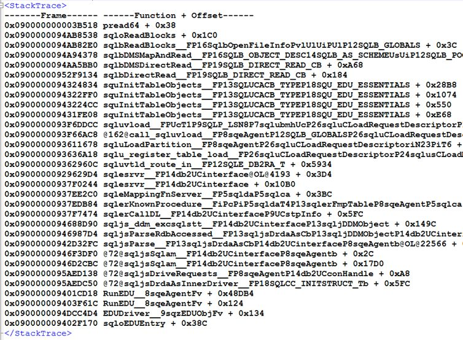
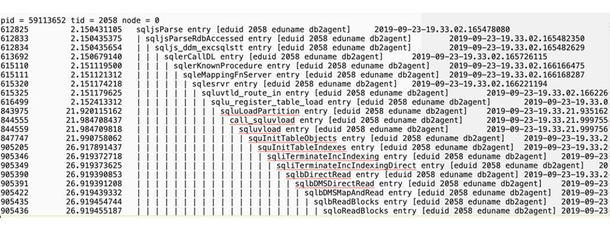

# DB2高危操作LOAD命令风险详解

LOAD是 DB2中的一个数据装载工具，它能够直接将格式化的数据写入数据库，而且只记录很少量的日志，因此比批量INSERT或者IMPORT的效率要高得多。但正是由于只写少量日志等特点，一旦LOAD失败可能会导致严重的问题，使得 LOAD命令变成了一个高风险的操作。在我行多年的数据库运维工作中，很多系统采用 LOAD提升了性能，满足了业务需求，但是也经历了很多惨痛的教训。本文重点梳理了LOAD操作常见的风险点，分析其原因，并给出相应的解决方法。

## 风险1：LOAD期间表不可访问

问题现象：访问正在进行LOAD操作的表时报错SQL0911N The current transaction has been rolled back because of a deadlock or timeout. Reason code "68". SQLSTATE=40001。

原因分析：默认的LOAD命令，比如 db2 load from a.del of del insert into a，是会锁表的，在LOAD期间会在目标表上加Z锁（超级排他锁），导致目标表不可访问。

解决方法: LOAD命令可以加上allow read access，这样在LOAD期间对表可以做查询操作。

## 风险2：LOAD正常完成后表状态异常

问题现象：LOAD操作正常完成，且没有任何报错，但在访问表的时候报错SQL0668N Operation not allowed for reason code "1" on table "<table-name>". SQLSTATE=57016，如果使用LOAD query table命令查看表状态，发现是Set Integrity Pending。

原因分析：除了不符合表的定义的记录外，LOAD操作只检查唯一性约束，不执行引用约束检查或表约束检查。当目标表有其他约束时，LOAD完成后表就会被置于set integrity pending状态，无论是否真的有记录违反约束 。

解决方法：对异常表发出set integrity命令可以解除Set Integrity Pending状态。

## 风险3：LOAD失败后表状态异常

问题现象：LOAD操作失败后，访问时表报错SQL0668N Operation not allowed for reason code "3" on table " <table-name> ". SQLSTATE=57016。

原因分析：如果LOAD操作因为某些原因，比如中断、表空间不足等而失败，那么失败后表就处于Load Pending状态，访问的时候就会报SQL0668N, reason code 3的报错，必须再发出一次LOAD命令才能解除这种状态。

解决方法: 将原来LOAD命令中的replace/insert into改成 restart/terminate into，重新发起一次即可，restart是继续上次失败的LOAD操作，terminate则是终止 LOAD操作，直接把表置于normal状态。

## 风险4：LOAD导致表空间状态异常

问题现象：LOAD操作在测试环境没有问题，但在生产上执行以后，对表更新操作的时候报错SQL0290N Table space access is not allowed. SQLSTATE=55039，对同一表空间中其他表也无法更新。

原因分析：数据库日志模式有循环日志和归档日志，前者的事务日志文件会被循环使用；后者日志文件会一直保留着，以便出现问题时能通过备份+重做日志来恢复到任意时间点的数据。LOAD操作是不记日志的，所以在归档日志模式下无法通过重做日志来恢复数据，为了避免出问题时数据不可恢复，DB2会强制把表所在表空间置于backup pending状态，在backup pending状态下，表空间中所有表不允许更新操作，必须对表空间做一个备份，才能解除该状态。测试环境采用的是循环日志模式，不存在该问题，生产环境采用的归档日志，所以遇到了问题。

解决方法：在LOAD命令里加上nonrecoverable参数，可以避免表空间进入backup pending状态。nonrecoverable的意思是，允许表不可恢复。

## 风险5：LOAD导致表数据无法通过备份恢复

问题现象：数据库0点进行全备， 4点有LOAD操作， 在8点时数据库异常，需要通过0点的备份加上0点到8点间的日志恢复数据库到7：59分的数据。恢复完成后，访问表的时候的报错SQL1477N For table "<table-name>" an object "<object-id>" in tablespace "<tbspace-id>" cannot be accessed. SQLSTATE=55019。

原因分析：如果一张表有不记日志的操作，那么重做日志(rollforward)之后，该表就进入不可访问状态，只能删除重建。LOAD操作不记日志，所以可能在恢复数据的时候遇到上面的问题。

解决方法：将nonrecoverable 修改为copy yes，或者在LOAD完成后立刻进行数据库备份。

## 风险6：LOAD导致HADR切换后表不可访问

问题现象：HADR架构的数据库，在切换到备机之后，访问表时报错SQL1477N For table "<table-name>" an object "<object-id>" in table space "<tbspace-id>" cannot be accessed. SQLSTATE=55019。

原因分析：原因和风险点5中的原因类似，HADR备机会一直重做主机的日志，当主机有不记日志的操作后，备机上该表状态进入不可访问状态，切换为主后不可访问。

解决方法：主机上如果有LOAD操作，可以使用copy yes的方式，并将主备机的某个共享目录作为copy yes的目标目录。

## 风险7：LOAD commit时间长导致应用查询锁超时

问题现象：分区表上的LOAD操作加了allow read access，但应用查询表时仍然报锁超时的错误SQL0911N Reason code "68"，Locker owner为该LOAD作业，hold住锁的类型为Z锁。

原因分析：LOAD操作会有一个commit阶段，这个阶段会把缓冲池中所有与这张表相关的页清除掉。对于分区表而言，commit时间随着缓冲池大小和分区表中分区的数量的增加而增加，与LOAD的数据量无关，在LOAD commit阶段，要在表上加Z锁，可能会导致其他并发应用的锁超时问题。

解决方法：对于分区表的情况，如果只LOAD数据到一个或者几个分区上，可以先detach出来这些分区，单独LOAD，完成之后再attach进去。

## 风险8：LOAD terminate时间过长

问题现象：某表由于LOAD失败进入Load Pending状态，在发出load terminate命令之后，一直没有返回，且该表不可访问。

原因分析：load terminate作业的stack如下

load terminate作业的trace如下：

从stack和trace可以看出，load termiate是在清理索引，并且进行的是Direct IO。如果LOAD命令加了allow read access和indexing mode incremental(默认)参数，并且在build阶段被中断了，那么后续的load terminate操作会清理索引。索引清理的时候进行了Direct IO，导致效率低下。进行Direct IO的原因是LOAD本身的设计，如果是在线LOAD，数据会经过buffer；如果是离线的，数据不经buffer，进行Direct IO。

解决方法：如果原来的LOAD命令加了allow read access并且被中断了，那么发出load terminate的时候，也要加上allow read access。