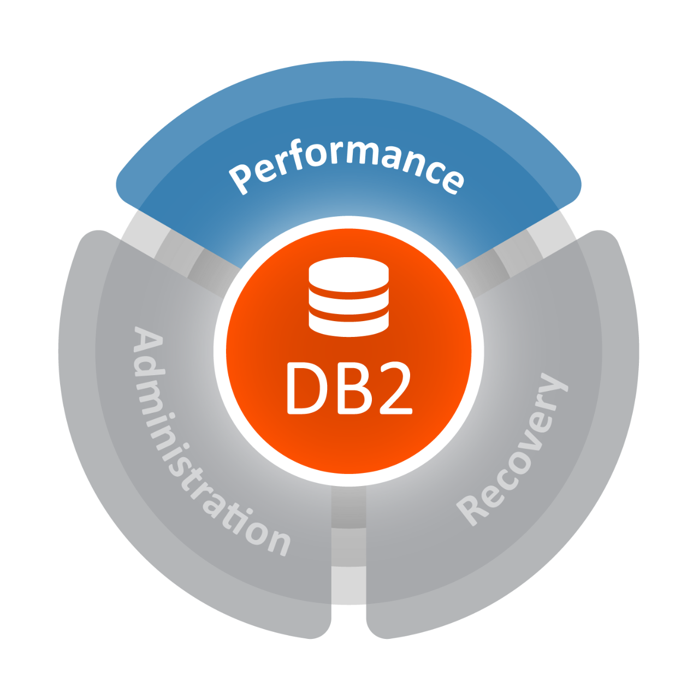
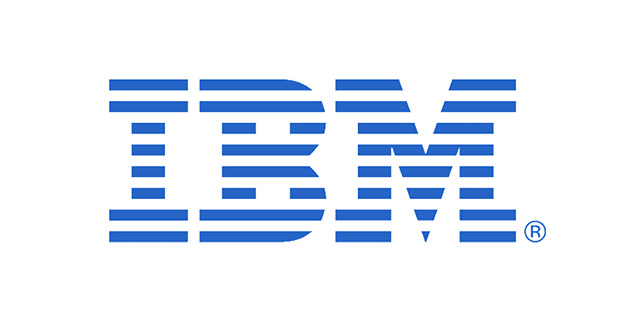

# DB2

IBM DB2企业服务器版本，是美国IBM公司发展的一套关系型数据库管理系统。它主要的运行环境为UNIX（包括IBM自家的AIX）、Linux、IBM i（旧称OS/400）、Z/OS，以及Windows服务器版本。DB2也提供性能强大的IBM InfoSphere Warehouse版本。和DB2同级的还有另外一个关系型数据库管理系统：Informix，它在2001年被IBM收购。

DB2主要应用于大型应用系统，具有较好的可伸缩性，可支持从大型机到单用户环境，应用于所有常见的服务器操作系统平台下。 DB2提供了高层次的数据利用性、完整性、安全性、可恢复性，以及小规模到大规模应用程序的执行能力，具有与平台无关的基本功能和SQL命令。DB2采用了数据分级技术，能够使大型机数据很方便地下载到LAN数据库服务器，使得客户机/服务器用户和基于LAN的应用程序可以访问大型机数据，并使数据库本地化及远程连接透明化。 DB2以拥有一个非常完备的查询优化器而著称，其外部连接改善了查询性能，并支持多任务并行查询。 DB2具有很好的网络支持能力，每个子系统可以连接十几万个分布式用户，可同时激活上千个活动线程，对大型分布式应用系统尤为适用。

DB2除了可以提供主流的OS/390和VM操作系统，以及中等规模的AS/400系统之外，IBM还提供了跨平台（包括基于UNIX的LINUX，HP-UX，SunSolaris，以及SCOUnixWare；还有用于个人电脑的OS/2操作系统，以及微软的Windows 2000和其早期的系统）的DB2产品。DB2数据库可以通过使用微软的开放数据库连接（ODBC）接口，Java数据库连接（JDBC）接口，或者CORBA接口代理被任何的应用程序访问。

从命令行方式到图形用户界面都可以使用DB2。命令行界面要求对产品知识的更多了解同样也更容易编写脚本并自动执行。图形界面是一个多平台的Java客户端，它包含了多种针对新手用户的向导服务。DB2同时支持SQL和XQuery。DB2本地执行XML数据存储，在这里XML数据以XML（不是关系型数据或者CLOB数据）格式存储以更快地通过使用XQuery进行访问。

DB2拥有基于 .NET CLI, Java, Python, Perl, PHP, Ruby, C++, C, REXX, PL/I, COBOL, RPG, FORTRAN的APIs，以及很多其它的程序语言。DB2同样支持集成于Eclipse和Visual Studio .NET集成开发环境之中。

## 错误处理

DB2计算机程序一个重要的特征就是错误处理。SQL communications area（SQLCA）结构曾一度被专门用于DB2程序在每个SQL语句被执行后向应用程序返回错误信息。在SQLCA block中常见错误诊断被体现在SQLCODE中。

SQL返回代码的值对应为：

- 0表示成功执行
- 正值表示成功执行但是有一个或多个警告。例如+100表示没有行被发现。
- 负值表示出现错误。例如－911表示锁超时（或死锁），并触发撤消程序。

DB2后来的版本增强了SQL语句执行的功能性和复杂性。多个错误或警告可以通过执行SQL语句被返回；它可以启动一个数据库触发器和其它SQL语句。替代最初的SQLCA，错误信息现在被连续不断的GET DIAGNOSTICS语句执行所检索。

察看更多的常见SQLCODEs列表SQL返回值。