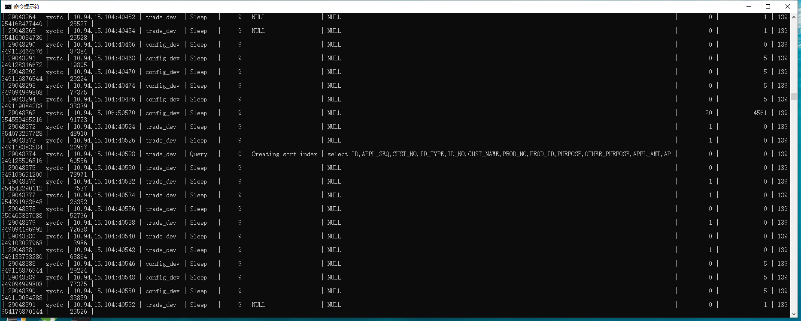

# MYSQL显示完整的processlist中info信息

由于数据库的使用导致cpu飙升，想要查询数据库的具体什么语句导致了cpu飙升需要查看运行中的sql语句
```
show  processlist;
```
如果有SUPER权限，则可以看到全部的线程，否则，只能看到自己发起的线程（这是指，当前对应的MySQL帐户运行的线程）。
```
mysql> show processlist;
+-------+-----------+---------------------+----------+---------+------+-------+------------------+
| Id | User | Host | db | Command | Time | State | Info |
+-------+-----------+---------------------+----------+---------+------+-------+------------------+
| 19161 | test_user | 171.8.216.253:63583 | tbkttest | Sleep | 685 | | NULL |
| 19164 | test_user | 171.8.216.253:63677 | tbkttest | Sleep | 297 | | NULL |
| 19165 | root | localhost | tbkttest | Query | 0 | NULL | show processlist |
| 19166 | root | localhost | NULL | Sleep | 36 | | NULL |
+-------+-----------+---------------------+----------+---------+------+-------+------------------+

4 rows in set (0.00 sec)
```

- id列，一个标识，你要kill一个语句的时候很有用。
- user列，显示单前用户，如果不是root，这个命令就只显示你权限范围内的sql语句。
- host列，显示这个语句是从哪个ip的哪个端口上发出的。可以用来追踪出问题语句的用户。
- db列，显示这个进程目前连接的是哪个数据库。
- command列，显示当前连接的执行的命令，一般就是休眠（sleep），查询（query），连接（connect）。
- time列，此这个状态持续的时间，单位是秒。
- state列，显示使用当前连接的sql语句的状态，很重要的列，后续会有所有的状态的描述，请注意，state只是语句执行中的某一个状态，一个sql语句，已查询为例，可能需要经过copying to tmp table，Sorting result，Sending data等状态才可以完成。
- info列，显示这个sql语句，因为长度有限，所以长的sql语句就显示不全，但是一个判断问题语句的重要依据。

使用show processlist;但是显示info信息是不全的，导致无法看到具体查询语句；

解决方法：
- 1：show full processlist;
- 2：select * from information_schema.processlist;