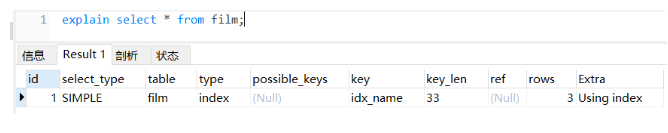
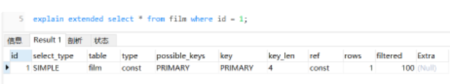
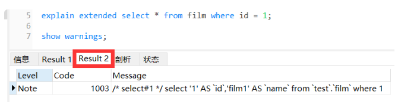
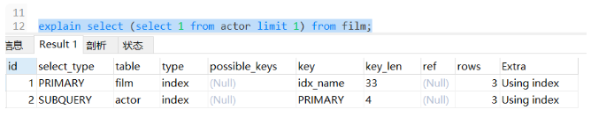
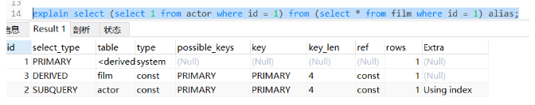
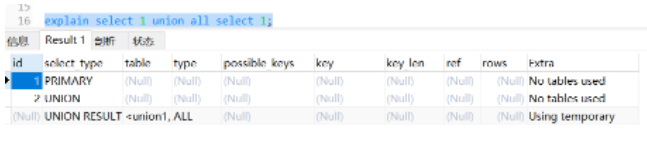

# Mysql中的explain

## 01 explain 简介

explain 就是一个分析 sql 执行的命令，主要用于 select 语句。通过它可以知道自己写的 sql 语句是否足够高效以及还有哪些可以优化的地方。

开篇之前声明下我的 MySQL 版本是：5.6.46，PS：5.6 之前的版本只能对 select 语句进行 explain，之后的版本可以对其他命令。
```SQL
#查询mysql版本信息
select VERSION();
```

开始之前我建了三张表并造了一些测试数据：

```SQL
DROP TABLE IF EXISTS `actor`;
CREATE TABLE `actor` (
  `id` int(11) NOT NULL,
  `name` varchar(45) DEFAULT NULL,
  `update_time` datetime DEFAULT NULL,
  PRIMARY KEY (`id`)
) ENGINE=InnoDB DEFAULT CHARSET=utf8;

INSERT INTO `actor` (`id`, `name`, `update_time`) VALUES (1,'a','2021-07-11 14:39:53'), (2,'b','2021-07-11 10:39:53'), (3,'c','2021-07-11 10:24:39');

DROP TABLE IF EXISTS `film`;
CREATE TABLE `film` (
  `id` int(11) NOT NULL AUTO_INCREMENT,
  `name` varchar(10) DEFAULT NULL,
  PRIMARY KEY (`id`),
  KEY `idx_name` (`name`)
) ENGINE=InnoDB DEFAULT CHARSET=utf8;

INSERT INTO `film` (`id`, `name`) VALUES (3,'film0'),(1,'film1'),(2,'film2');

DROP TABLE IF EXISTS `film_actor`;
CREATE TABLE `film_actor` (
  `id` int(11) NOT NULL,
  `film_id` int(11) NOT NULL,
  `actor_id` int(11) NOT NULL,
  PRIMARY KEY (`id`),
  KEY `idx_film_actor_id` (`film_id`,`actor_id`)
) ENGINE=InnoDB DEFAULT CHARSET=utf8;

INSERT INTO `film_actor` (`id`, `film_id`, `actor_id`) VALUES (1,1,1),(2,1,2),(3,2,1);
```

### 1.1 初体验
explain 的使用非常简单，在 sql 前面加 explain 即可：
```sql
explain select * from film;
```


除此以外 mysql 还有以下两个扩展，这个知道即可。

#### 1.1.1 explain extended

它会在 explain  的基础上额外提供一些查询优化的信息，从下图可以看出。它比 explain 多了一个 filtered 列，是一个百分比值，rows * filtered/100 可以估算出将要和 explain 中前一个表进行连接的行数（前一个表指 explain 中的 id 值比当前表 id 值小的表）

跟 show warnings 两条语句一起执行，MySQL 就会给出优化后的 sql 语句，可以看出 MySQL 帮我们优化了什么。


#### 1.1.2 explain partitions
比 explain 多了个 partitions 字段，如果查询是基于分区表的话，会显示查询将访问的分区。

## 02 为什么要用 explain？
原因很简单。通过 explain 命令我们可以学习到该条 sql 是如何执行的，随后解析 explain 的结果可以帮助我们使用更好的索引，最终来优化它！

通过 explain 命令我们可以知道以下信息：表的读取顺序，数据读取操作的类型，哪些索引可以使用，哪些索引实际使用了，表之间的引用，每张表有多少行被优化器查询等信息。

## 03 读懂 explain 的结果列

从上图我们可以知道：explain 命令输出的结果有 10 列，分别是：id、select_type、table、type、possible_keys、key、key_len、ref、rows、Extra

接下来我将逐一分析这些结果列代表的含义，希望对你有帮助：

### 3.1 id 列
一组数字，表示 sql 语句中 select 的执行顺序，有几个 select 就有几个 id，按照 select 出现的顺序呈现结果。

有几种情况：

- id 相同，执行顺序由上而下
- id 不同，序号会递增。值越大优先级越高，就越先执行



### 3.2 select_type 列
见名知义，就是 select 查询的类型，它的结果有好多种，且听我分析，加粗的都是常见的，得知道意思。

1. simple：简单查询。查询不包含子查询和 union，比如上面简介中演示的语句
2. primary：跟上面相反，如果查询包含子查询和 union，就会被标记为 primary
3. subquery：见名知义，包含在 select 中的子查询（不在 from 子句中）
4. derived：在 from 子句中子查询，MySQL 会将结果存放在一个临时表中，也称为派生表（derived 的英文含义）

举个例子，你就知道它们的的区别了：
```sql
explain select (select 1 from actor where id = 1) from (select * from film where id = 1) alias;
```


5. union：表示此查询是 UNION 中的第二个或随后的查询
6. union result：从 union 临时表检索结果的 select
举个栗子，帮助你们分清楚区别：
```sql
explain select 1 union all select 1;
```


7. dependent union：此查询是 UNION 中的第二个或随后的查询，其次取决于外面的查询
8. uncacheable union：此查询是 UNION 中的第二个或随后的查询，同时意味着 select 中的某些特性阻止结果被缓存于一个 Item_cache 中
9. dependent subquery：子查询中的 第一个 select，同时取决于外面的查询
10. uncacheable subquery：子查询中的 第一个 select，同时意味着 select 中的某些特性阻止结果被缓存于一个 Item_cache 中

### 3.3 table 列

表示 explain 的一行访问的表是哪一个

- 当 from 子句中有子查询时，table 列是 <derivenN> 格式，表示当前查询依赖 id=N 的查询，于是先执行 id=N 的查询
- 当有 union 时，UNION RESULT 的 table 列的值为 <union1,2>，1 和 2 表示参与 union 的 select 行 id

### 3.4 type 列

表关联类型或访问类型，重要的一列，是判断查询是否高效的一句：也就是 MySQL 决定如何查找表中的行就看这个列。

结果有很多，性能从最优到最差为：system > const > eq_ref > ref > fulltext > ref_or_null > index_merge > unique_subquery > index_subquery > range > index > ALL

我就挑几个常见的取值聊聊，没聊到的证明我也没遇到过，哈哈哈：

- ALL：全表扫描，性能极差。敲黑板哈，这种类型是不应该出现的，一定还可以加索引优化。
- index：全索引扫描，跟 ALL 差不多，不同的是 index 是扫描整棵索引树，比 ALL 要快些。
- range：范围扫描，通常出现在 in (), between ,> ,<, >= 等操作中。使用一个索引来检索给定范围的行。
- ref：索引查找，不使用唯一索引，使用普通索引或者唯一性索引的部分前缀，索引要和某个值相比较，可能会找到多个符合条件的行。
- eq_ref：最多只返回一条符合条件的记录。在使用唯一性索引或主键查找时会出现该值，非常高效。
- const、system：该表至多有一个匹配行，在查询开始时读取，或者该表是系统表，只有一行匹配。其中 const 用于在和 primary key 或 unique 索引中有固定值比较的情形。
- null：在执行阶段用不着再访问表或索引。

### 3.5 possible_keys 列
表示 MySQL 执行查询可能会使用那些索引来查找，如果为 null，可考虑在该列加个索引。

### 3.6 key 列
表示 MySQL 执行查询实际使用那些索引来查找，如果为 null，则证明没有使用索引。如果想强制使用或者忽略索引可以在查询语句加 force index（想要强制使用的索引名）或者  ignore index（想要忽略的索引名）

PS：如果 possible_keys 有列，而 key 显示 null 的情况，可能是因为表数据不多，加索引作用也不大。

### 3.7 key_len 列
在索引里使用的字节数，当 key 列的值为 NULL 时，则该列也是 NULL

PS：索引的最大长度是 768 字节，字符串过长时，MySQL 会将前半部分提出来做索引，这点大家需要注意。（不过一般我们也不会在这么长的字段上建索引）

### 3.8 ref 列
那些字段或者常量被用来和 key 列记录的索引配合查找值，常见的有：const（常量），func，NULL，字段名（例：film.id）

### 3.9 rows 列
这一列是 mysql 估计要读取并检测的行数，注意这个不是结果集里的行数。（只是个预测的数量）

### 3.10 Extra 列
额外信息，也非常重要

- Using index：使用覆盖索引，表示查询索引就可查到所需数据，不用回表，说明性能不错。
- Using where：在存储引擎检索行后再进行过滤，就是先读取整行数据，再按 where 条件进行取舍。
- Using temporary：mysql 需要创建一张临时表来处理查询，一般是因为查询语句中有排序、分组、和多表 join 的情况，一般是要进行优化的。
- Using filesort：对结果使用一个外部索引排序，而不是按索引次序从表里读取行，一般有出现该值，都建议优化去掉，因为这样的查询 CPU 资源消耗大。