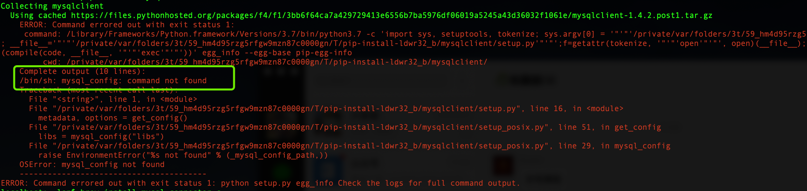
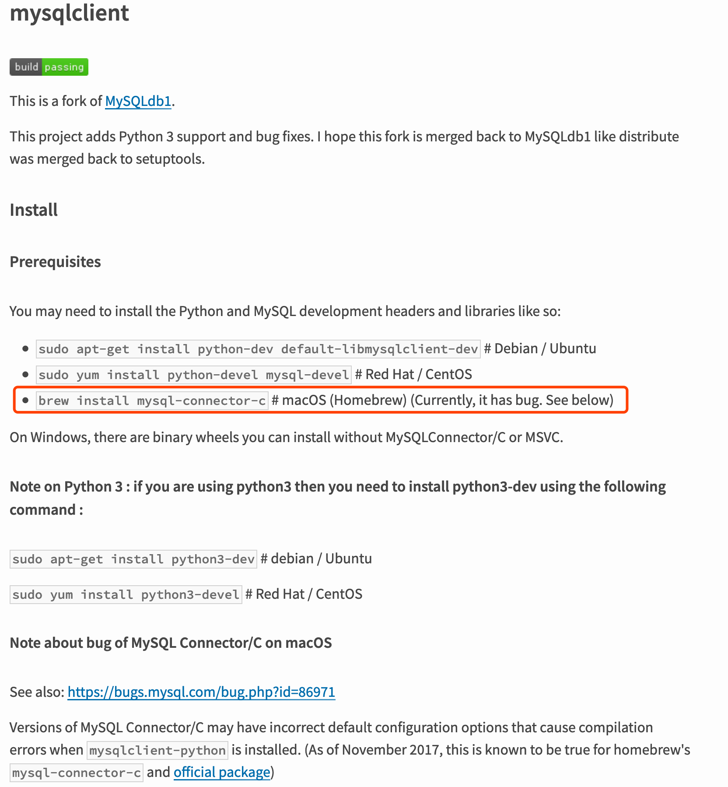
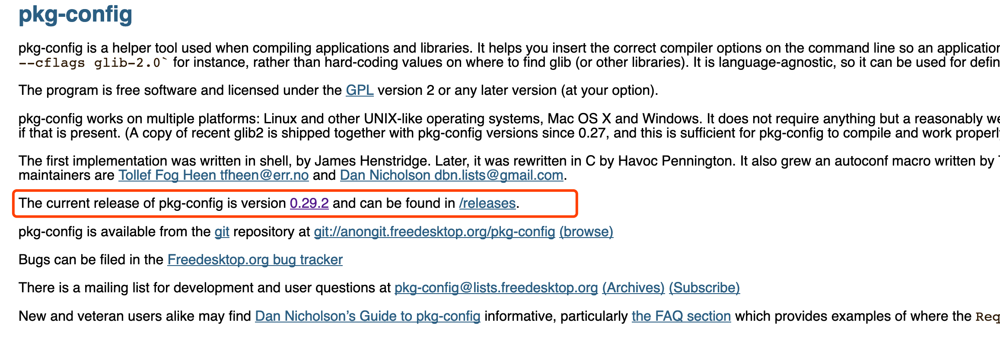
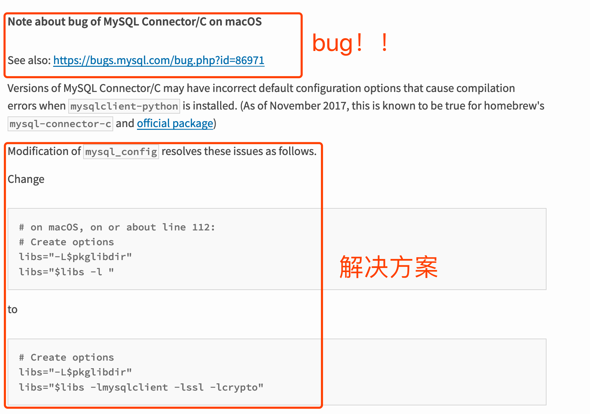

# Mysql之MacOS安装mysqlclient

因为Django连接mysql 需要安装mysqlclient， 但Mac安装遇到各种问题，这里记录一下，避免以后再踩坑。

1.正常情况下，安装mysqlclient ，只要执行命令： pip install mysqlclient 即可。

但Mac如果没有安装过mysql驱动， 会提示如下报错： mysql_config: command not found !!!



2.查阅官网： https://pypi.org/project/mysqlclient/

官网介绍到，安装mysqlclient 之前，需要先安装mysql-connector-c



执行命令安装mysql-connector-c

```
brew install mysql-connector-c
```
如果安装过程中出现如下pkg-config类似错误，那么说明需要安装pkg-config

```
error: The pkg-config script could not be found or is too old.  Make sure it is in your PATH or set the PKG_CONFIG environment variable to the full path to pkg-config.
```
下面是到官网下载pkg-config 并安装，如果没有出现上面pkg-config的错误，可以跳过这一步，直接到第3步即可

[pkg-config官网](https://www.freedesktop.org/wiki/Software/pkg-config/)


点击version 0.29.2 进行下载，下载完成后解压，进入目录顺序执行下面3步。
```
./configure
make
make install
```
如果不幸， 在执行第一步的时候就出现如下错误：
```
configure: error: Either a previously installed pkg-config or "glib-2.0 >= 2.16" could not be found. Please set GLIB_CFLAGS and GLIB_LIBS to the correct values or pass --with-internal-glib to configure to use the bundled copy.
```
则可把第一步的命令改成:
```
./configure --with-internal-glib
```
安装成功后，建议重启电脑（我没重启电脑前，还是没法安装mysql-connector-c）

3. 安装mysql-connector-c成功后， 根据官方说明， 这东西在MacOS中居然有bug！！

还好， 官网说明这东西还有解决版本，就是修改mysql_cofig配置文件，如果你不知道mysql_config在哪里，可以执行下面命令查找。
```
which mysql_config
```
然后修改mysql_config 里面的112行，不过which mysql_config 查找处理的文件可能只是mysql_config的一个链接（macOS 俗称替身， 无法直接修改）

所以我们要找到它的原身。例如你which mysql_config 找到的路径为： /usr/local/bin/mysql_config

那么我们cd到该路径 /usr/local/bin/ 下，然后执行 ls -l 查看文件信息。


可以看到mysql_config的真实路径是在../Cellar/mysql-connector-c/6.1.11/bin/mysql_config

这样我们就可以找到它，再进行如下修改了：
```
Change
# on macOS, on or about line 112:
# Create options
libs="-L$pkglibdir"
libs="$libs -l "
 
to
# Create options
libs="-L$pkglibdir"
libs="$libs -lmysqlclient -lssl -lcrypto"
```
修改成功后，这时候我们就可以执行安装mysqlclient了
```
pip install mysqlclient
```