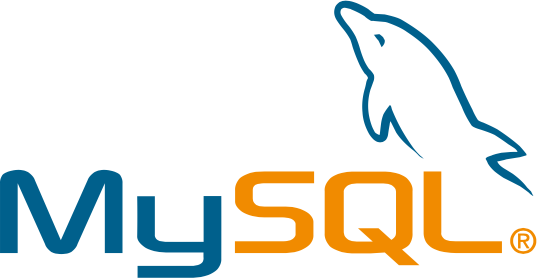

# Mysql

MySQL（官方发音为/maɪ ˌɛskjuːˈɛl/“My S-Q-L”，但也经常被错误读作/maɪ ˈsiːkwəl/“My Sequel”）原本是一个开放源码的关系数据库管理系统，原开发者为瑞典的MySQL AB公司，该公司于2008年被昇阳微系统（Sun Microsystems）收购。2009年，甲骨文公司（Oracle）收购昇阳微系统公司，MySQL成为Oracle旗下产品。

MySQL在过去由于性能高、成本低、可靠性好，已经成为最流行的开源数据库，因此被广泛地应用在Internet上的中小型网站中。随着MySQL的不断成熟，它也逐渐用于更多大规模网站和应用，比如中文维基百科、Google和Facebook等网站。非常流行的开源软件组合LAMP中的“M”指的就是MySQL。

但被甲骨文公司收购后，Oracle大幅调涨MySQL商业版的售价，且甲骨文公司不再支持另一个自由软件项目OpenSolaris的发展，因此导致自由软件社群们对于Oracle是否还会持续支持MySQL社群版（MySQL之中唯一的免费版本）有所隐忧，MySQL的创始人麦克尔·维德纽斯以MySQL为基础，成立分支计划MariaDB。而原先一些使用MySQL的开源软件逐渐转向MariaDB或其它的数据库。例如中文维基百科已于2013年正式宣布将从MySQL迁移到MariaDB数据库。

## 特性
- 使用C和C++编写，并使用了多种编译器进行测试，保证源代码的可移植性。
- 支持AIX、BSDi、FreeBSD、HP-UX、Linux、Mac OS、Novell NetWare、NetBSD、OpenBSD、OS/2 Wrap、Solaris、Windows等多种操作系统。
- 为多种编程语言提供了API。这些編程语言包括C、C++、C#、VB.NET、Delphi、Eiffel、Java、Perl、PHP、Python、Ruby和Tcl等。
- 支持多线程，充分利用CPU资源，支持多用户。
- 优化的SQL查询算法，有效地提高查询速度。
- 既能够作为一个单独的应用程序在客户端服务器网络环境中运行，也能够作为一个程序库而嵌入到其他的软件中。
- 提供多语言支持，常见的编码如中文的GB 2312、BIG5，日文的Shift JIS等都可以用作数据表名和数据列名。
- 提供TCP/IP、ODBC和JDBC等多种数据库连接途径。
- 提供用于管理、检查、優化数据库操作的管理工具。
- 可以处理拥有上千万条记录的大型数据库。

## 应用
与其他的大型数据库例如Oracle、IBM DB2、MS SQL等相比，MySQL自有它的不足之处，如规模小、功能有限等，但是这丝毫也没有减少它受欢迎的程度。对于一般的个人用户和中小型企业来说，MySQL提供的功能已经绰绰有余，而且由于MySQL是开放源码软件，因此可以大大降低总体拥有成本。

2010年以前Internet上流行的网站构架方式是LAMP（Linux Apache MySQL PHP），即是用Linux作为操作系统，Apache作为Web服务器，MySQL作为数据库，PHP（部分网站也使用Perl或Python）作为服务器端脚本解释器。由于这四个软件都是开放源码软件，因此使用这种方式可以以较低的成本创建起一个稳定、免费的网站系统。MySQL加PHP的配对在互联网上的应用相比LAMP来说更为常见，并获得了“动态配对”（Dynamic Duo）的雅号，大部分Blog网站基于的WordPress系统主要运用MySQL加PHP的配对。除了LAMP之外，用于Solaris、Windows和Mac上的网站构架也分别被称为SAMP、WAMP和MAMP。
## 连接方式
- 应用程序可透过ODBC或ADO方式，经由使用MyODBC与MySQL数据库连接。
- MS .Net Framework下的程序（例如：C#、VB.NET）可透过ADO.NET的方式，经由使用MySQL.Net与MySQL数据库连接。
- C/C++可使用MySQL++或是直接使用MySQL内置API与MySQL数据库连接。
- PHP可透过PHP的MySQLi与MySQL数据库连接，具备比MySQL模块更好的性能。另外PHP6可使用mysqlnd与MySQL数据库连接。
- JAVA程序可通过JDBC方式与MySQL进行连接，MySQL官方提供了JDBC驱动程序。
- 可通过MySQL客户端软件与MySQL进行连接，如mysqlfront、mysqlyog、mysqlbrowser等。
- javascript可以通过使用fibjs的内置mysql模块与MySQL数据库连接
