# Redis监控以及指标

### 监控指标性能指标：

- 性能指标：Performance
- 内存指标: Memory
- 基本活动指标：Basic activity
- 持久性指标: Persistence
- 错误指标：Error

### 性能指标：Performance

| **Name**                  | **Description**         |
| ------------------------- | ----------------------- |
| latency                   | Redis响应一个请求的时间 |
| instantaneous_ops_per_sec | 平均每秒处理请求总数    |
| hi rate(calculated)       | 缓存命中率（计算出来的  |

### 内存指标: Memory

| **Name**                | **Description**                               |
| ----------------------- | --------------------------------------------- |
| used_memory             | 已使用内存                                    |
| mem_fragmentation_ratio | 内存碎片率                                    |
| evicted_keys            | 由于最大内存限制被移除的key的数量             |
| blocked_clients         | 由于BLPOP,BRPOP,or BRPOPLPUSH而备阻塞的客户端 |

### 基本活动指标：Basic activity

| **Name**                   | **Description**            |
| -------------------------- | -------------------------- |
| connected_clients          | 客户端连接数               |
| conected_laves             | slave数量                  |
| master_last_io_seconds_ago | 最近一次主从交互之后的秒数 |
| keyspace                   | 数据库中的key值总数        |

### 持久性指标: Persistence

| **Name**                   | **Description**                    |
| -------------------------- | ---------------------------------- |
| rdb_last_save_time         | 最后一次持久化保存磁盘的时间戳     |
| rdb_changes_sice_last_save | 自最后一次持久化以来数据库的更改数 |

### 错误指标：Error

| **Name**                       | **Description**                       |
| ------------------------------ | ------------------------------------- |
| rejected_connections           | 由于达到maxclient限制而被拒绝的连接数 |
| keyspace_misses                | key值查找失败(没有命中)次数           |
| master_link_down_since_seconds | 主从断开的持续时间（以秒为单位)       |

### 监控方式

- redis-benchmark
- redis-stat
- redis-faina
- redislive
- redis-cli
- monitor
- showlog

1.get：获取慢查询日志2.len：获取慢查询日志条目数3.reset：重置慢查询日志

相关配置：

slowlog-log-slower-than 1000 # 设置慢查询的时间下线，单位：微秒
slowlog-max-len 100 # 设置慢查询命令对应的日志显示长度，单位：命令数

info（可以一次性获取所有的信息，也可以按块获取信息）

1.server:服务器运行的环境参数2.clients:客户端相关信息3.memory：服务器运行内存统计数据4.persistence：持久化信息5.stats：通用统计数据6.Replication：主从复制相关信息7.CPU：CPU使用情况8.cluster：集群信息9.Keypass：键值对统计数量信息

终端info命令使用

./redis-cli info 按块获取信息 | grep 需要过滤的参数
./redis-cli info stats | grep ops

### 性能监控：

redis-cli info | grep ops # 每秒操作数

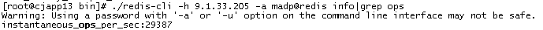

### 内存监控：

[root@CombCloud-2020110836 src]# ./redis-cli info | grep used | grep human    
used_memory_human:2.99M # 内存分配器从操作系统分配的内存总量
used_memory_rss_human:8.04M #操作系统看到的内存占用，top命令看到的内存
used_memory_peak_human:7.77M # redis内存消耗的峰值
used_memory_lua_human:37.00K  # lua脚本引擎占用的内存大小

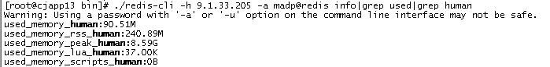

由于BLPOP,BRPOP,or BRPOPLPUSH而备阻塞的客户端

./redis-cli -h 9.1.33.205 -a madp@redis info|grep blocked_clients

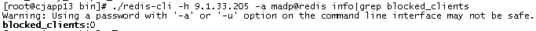

由于最大内存限制被移除的key的数量

./redis-cli -h 9.1.33.205 -a madp@redis info|grep evicted_keys

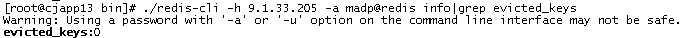

内存碎片率

./redis-cli -h 9.1.33.205 -a madp@redis info|grep mem_fragmentation_ratio


已使用内存

./redis-cli -h 9.1.33.205 -a madp@redis info|grep used_memory:

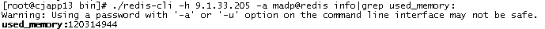

### 基本活动指标：

redis连接了多少客户端 通过观察其数量可以确认是否存在意料之外的连接。如果发现数量不对劲，就可以使用lcient list指令列出所有的客户端链接地址来确定源头。


```
[root@CombCloud-2020110836 src]# ./redis-cli info | grep connected_clients
connected_clients:1
```


```
[root@CombCloud-2020110836 src]# ./redis-cli info | grep connected
connected_clients:1   # 客户端连接数量
connected_slaves:1   # slave连接数量
```

### 持久性指标：

[root@CombCloud-2020110836 src]# ./redis-cli info | grep rdb_last_save_time
rdb_last_save_time:1591876204 # 最后一次持久化保存磁盘的时间戳
[root@CombCloud-2020110836 src]# ./redis-cli info | grep rdb_changes_since_last_save
rdb_changes_since_last_save:0  # 自最后一次持久化以来数据库的更改数

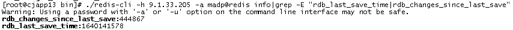

### 错误指标：

由于超出最大连接数限制而被拒绝的客户端连接次数，如果这个数字很大，则意味着服务器的最大连接数设置得过低，需要调整maxclients

[root@CombCloud-2020110836 src]# ./redis-cli info | grep connected_clients
connected_clients:1

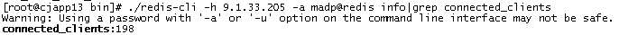


key值查找失败(没有命中)次数，出现多次可能是被攻击


```
[root@CombCloud-2020110836 src]# ./redis-cli info | grep keyspace
keyspace_misses:0  
```

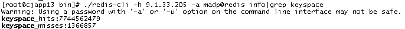


主从断开的持续时间（以秒为单位)


```
[root@CombCloud-2020110836 src]# ./redis-cli info | grep rdb_changes_since_last_save
rdb_changes_since_last_save:0  
```

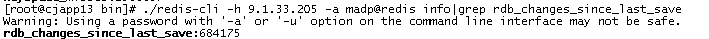


复制积压缓冲区如果设置得太小，会导致里面的指令被覆盖掉找不到偏移量，从而触发全量同步


```
[root@CombCloud-2020110836 src]# ./redis-cli info | grep backlog_size
repl_backlog_size:1048576
```

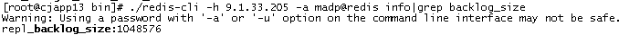


通过查看sync_partial_err变量的次数来决定是否需要扩大积压缓冲区，它表示主从半同步复制失败的次数


```
[root@CombCloud-2020110836 src]# ./redis-cli info | grep sync_partial_err
sync_partial_err:1
```

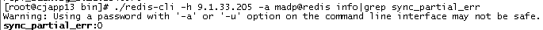


### redis性能测试命令


```
./redis-benchmark -c 100 -n 5000
```


说明：100个连接，5000次请求对应的性能
