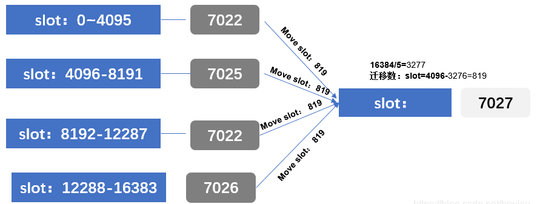

# Redis集群常用命令

集群(cluster) :**这些命令是集群所独有的。执行上述命令要先登录**

```shell
#查看redis进程信息：
ps -ef|grep redis
sit_rsc+  29023  93775 50 15:03 ?        00:00:17 redis-rdb-bgsave 9.1.32.118:6181 [cluster]
root      29100  29049  0 15:04 pts/0    00:00:00 grep --color=auto redis
sit_rsc+  93775      1  5 4月21 ?       00:58:25 redis-server 9.1.32.118:6181 [cluster]

#查看redis集群信息：
redis-cli -h 9.1.32.118 -p 6181 cluster nodes
或者
redis-trib.rb check 9.1.32.118:6181
redis-trib.rb info 9.1.32.118:6181
```
```shell
redis-cli -h
Usage: redis-cli [OPTIONS] [cmd [arg [arg ...]]]
  -h <hostname>      Server hostname (default: 127.0.0.1).
  -p <port>          Server port (default: 6379).
  -s <socket>        Server socket (overrides hostname and port).
  -a <password>      Password to use when connecting to the server.
                     You can also use the REDISCLI_AUTH environment
                     variable to pass this password more safely
                     (if both are used, this argument takes precedence).
  --user <username>  Used to send ACL style 'AUTH username pass'. Needs -a.
  --pass <password>  Alias of -a for consistency with the new --user option.
  --askpass          Force user to input password with mask from STDIN.
                     If this argument is used, '-a' and REDISCLI_AUTH
                     environment variable will be ignored.
  -u <uri>           Server URI.
  -r <repeat>        Execute specified command N times.
  -i <interval>      When -r is used, waits <interval> seconds per command.
                     It is possible to specify sub-second times like -i 0.1.
  -n <db>            Database number.
  -3                 Start session in RESP3 protocol mode.
  -x                 Read last argument from STDIN.
  -d <delimiter>     Delimiter between response bulks for raw formatting (default: \n).
  -D <delimiter>     Delimiter between responses for raw formatting (default: \n).
  -c                 Enable cluster mode (follow -ASK and -MOVED redirections).
  -e                 Return exit error code when command execution fails.
  --raw              Use raw formatting for replies (default when STDOUT is
                     not a tty).
  --no-raw           Force formatted output even when STDOUT is not a tty.
  --quoted-input     Force input to be handled as quoted strings.
  --csv              Output in CSV format.
  --show-pushes <yn> Whether to print RESP3 PUSH messages.  Enabled by default when
                     STDOUT is a tty but can be overriden with --show-pushes no.
  --stat             Print rolling stats about server: mem, clients, ...
  --latency          Enter a special mode continuously sampling latency.
                     If you use this mode in an interactive session it runs
                     forever displaying real-time stats. Otherwise if --raw or
                     --csv is specified, or if you redirect the output to a non
                     TTY, it samples the latency for 1 second (you can use
                     -i to change the interval), then produces a single output
                     and exits.
  --latency-history  Like --latency but tracking latency changes over time.
                     Default time interval is 15 sec. Change it using -i.
  --latency-dist     Shows latency as a spectrum, requires xterm 256 colors.
                     Default time interval is 1 sec. Change it using -i.
  --lru-test <keys>  Simulate a cache workload with an 80-20 distribution.
  --replica          Simulate a replica showing commands received from the master.
  --rdb <filename>   Transfer an RDB dump from remote server to local file.
                     Use filename of "-" to write to stdout.
  --pipe             Transfer raw Redis protocol from stdin to server.
  --pipe-timeout <n> In --pipe mode, abort with error if after sending all data.
                     no reply is received within <n> seconds.
                     Default timeout: 30. Use 0 to wait forever.
  --bigkeys          Sample Redis keys looking for keys with many elements (complexity).
  --memkeys          Sample Redis keys looking for keys consuming a lot of memory.
  --memkeys-samples <n> Sample Redis keys looking for keys consuming a lot of memory.
                     And define number of key elements to sample
  --hotkeys          Sample Redis keys looking for hot keys.
                     only works when maxmemory-policy is *lfu.
  --scan             List all keys using the SCAN command.
  --pattern <pat>    Keys pattern when using the --scan, --bigkeys or --hotkeys
                     options (default: *).
  --quoted-pattern <pat> Same as --pattern, but the specified string can be
                         quoted, in order to pass an otherwise non binary-safe string.
  --intrinsic-latency <sec> Run a test to measure intrinsic system latency.
                     The test will run for the specified amount of seconds.
  --eval <file>      Send an EVAL command using the Lua script at <file>.
  --ldb              Used with --eval enable the Redis Lua debugger.
  --ldb-sync-mode    Like --ldb but uses the synchronous Lua debugger, in
                     this mode the server is blocked and script changes are
                     not rolled back from the server memory.
  --cluster <command> [args...] [opts...]
                     Cluster Manager command and arguments (see below).
  --verbose          Verbose mode.
  --no-auth-warning  Don't show warning message when using password on command
                     line interface.
  --help             Output this help and exit.
  --version          Output version and exit.

Cluster Manager Commands:
  Use --cluster help to list all available cluster manager commands.

Examples:
  cat /etc/passwd | redis-cli -x set mypasswd
  redis-cli get mypasswd
  redis-cli -r 100 lpush mylist x
  redis-cli -r 100 -i 1 info | grep used_memory_human:
  redis-cli --quoted-input set '"null-\x00-separated"' value
  redis-cli --eval myscript.lua key1 key2 , arg1 arg2 arg3
  redis-cli --scan --pattern '*:12345*'

  (Note: when using --eval the comma separates KEYS[] from ARGV[] items)

When no command is given, redis-cli starts in interactive mode.
Type "help" in interactive mode for information on available commands
and settings.
```
## 1、查看集群

cluster info 打印集群的信息。
cluster nodes 列出集群当前已知的所有节点（node），以及这些节点的相关信息。

## 2、节点(node)  命令

### 1、加入节点：将 ip 和 port 所指定的节点添加到集群当中，让它成为集群的一份子。

1) cluster meet <ip> <port> 
2) redis-trib.rb add-node <ip> <port>  10.25.157.78:7022 

例如：新增节点：10.80.82.74:7029

```shell
redis-trib.rb add-node 10.80.82.74:7029 10.25.157.78:7022 
```

### 2、移除节点：

1) 登陆集群任意节点：执行：cluster forget <node_id> 
2) redis-trib.rb del-node  <ip> <port>  <node_id>

例如

```shell
redis-trib.rb del-node 10.80.82.74:7030 923e869b3fda8add429fb200ea00ce94bdbc84e6
cluster forget 923e869b3fda8add429fb200ea00ce94bdbc84e6
```

### 3、设置主从节点：

cluster replicate <node_id> 将当前节点设置为 node_id 指定的节点的从节点。  

### 4、节点数据备份到硬盘：

cluster saveconfig 将节点的配置文件保存到硬盘里面。   

## 3、槽(slot命令

cluster addslots <slot> [slot ...] 将一个或多个槽（slot）指派（assign）给当前节点。
cluster delslots <slot> [slot ...] 移除一个或多个槽对当前节点的指派。
cluster flushslots 移除指派给当前节点的所有槽，让当前节点变成一个没有指派任何槽的节点。
cluster setslot <slot> node <node_id> 将槽 slot 指派给 node_id 指定的节点，如果槽已经指派给另一个节点，那么先让另一个节点删除该槽>，然后再进行指派。
cluster setslot <slot> migrating <node_id> 将本节点的槽 slot 迁移到 node_id 指定的节点中。
cluster setslot <slot> importing <node_id> 从 node_id 指定的节点中导入槽 slot 到本节点。
cluster setslot <slot> stable 取消对槽 slot 的导入（import）或者迁移（migrate）。

## 4、键 (key) 命令

cluster keyslot <key> 计算键 key 应该被放置在哪个槽上。  
cluster countkeysinslot <slot> 返回槽 slot 目前包含的键值对数量。  
cluster getkeysinslot <slot> <count> 返回 count 个 slot 槽中的键。  

## 5、redis cluster管理工具redis-trib.rb详解

redis-trib.rb是redis官方推出的管理redis集群的工具，集成在redis的源码src目录下，是基于redis提供的集群命令封装成简单、便捷、实用的操作工具。redis-trib.rb是redis作者用ruby完成的。

### redis-trib管理器

Redis作者应该是个Ruby爱好者，Ruby客户端就是他开发的。这次集群的管理功能没有嵌入到Redis代码中，于是作者又顺手写了个叫做redis-trib的管理脚本。redis-trib依赖Ruby和RubyGems，以及redis扩展。可以先用which命令查看是否已安装ruby和rubygems，用gem list –local查看本地是否已安装redis扩展。

最简便的方法就是用apt或yum包管理器安装RubyGems后执行gem install redis。如果网络或环境受限的话，可以手动安装RubyGems和redis扩展
```
#安装rub管理工具rvm
    gpg2 --keyserver hkp://keys.gnupg.net --recv-keys D39DC0E3
    curl -L get.rvm.io | bash -s stable
    find / -name rvm -print
#加载rvm
    source /usr/local/rvm/scripts/rvm
    #查看ruby版本
     rvm list known
 #安装ruby，这里我们选择安装2.5.1
    rvm install 2.5.1
    rvm use 2.5.1 --default
 #安装redis-trib.rb即redis集群工具
    gem install redis -v 3.3.5
  #安装完成后的目录为：
    /mnt/src/redis-4.0.9/src/redis-trib.rb
```
执行  /mnt/src/redis-4.0.9/src/redis-trib.rb报错：/usr/bin/env: ruby: No such file or directory
由于redis-trib.rb脚本是ruby脚本，它依赖ruby环境。
需要安装ruby的环境，推荐使用yum install ruby安装：yum install ruby

可以通过redis-trib.rb的help信息，看下redis-trib.rb提供了哪些功能。可以看到redis-trib.rb具有以下功能：
1. create：创建集群
2. check：检查集群
3. info：查看集群信息
4. fix：修复集群
5. reshard：在线迁移slot
6. rebalance：平衡集群节点slot数量
7. add-node：将新节点加入集群
8. del-node：从集群中删除节点
9. set-timeout：设置集群节点间心跳连接的超时时间
10. call：在集群全部节点上执行命令
11. import：将外部redis数据导入集群

redis-trib.rb主要有两个类：ClusterNode和RedisTrib。ClusterNode保存了每个节点的信息，RedisTrib则是redis-trib.rb各个功能的实现。

#### ClusterNode对象

先分析ClusterNode源码。ClusterNode有下面几个成员变量（ruby的类成员变量是以@开头的）：

@r：执行redis命令的客户端对象。
@info：保存了该节点的详细信息，包括cluster nodes命令中自己这行的信息和cluster info的信息。
@dirty：节点信息是否需要更新，如果为true，我们需要把内存的节点更新信息到节点上。
@friends：保存了集群其他节点的info信息。其信息为通过cluster nodes命令获得的其他节点信息。

##### ClusterNode有下面一些成员方法：

initialize：ClusterNode的构造方法，需要传入节点的地址信息。
friends：返回@friends对象。
slots：返回该节点负责的slots信息。
has_flag?：判断节点info信息的的flags中是否有给定的flag。
to_s：类似java的toString方法，返回节点的地址信息。
connect：连接redis节点。
assert_cluster：判断节点开启了集群配置。
assert_empty：确定节点目前没有跟任何其他节点握手，同时自己的db数据为空。
load_info：通过cluster info和cluster nodes导入节点信息。
add_slots：给节点增加slot，该操作只是在内存中修改，并把dirty设置成true，等待flush_node_config将内存中的数据同步在节点执行。
set_as_replica：slave设置复制的master地址。dirty设置成true。
flush_node_config：将内存的数据修改同步在集群节点中执行。
info_string：简单的info信息。
get_config_signature：用来验证集群节点见的cluster nodes信息是否一致。该方法返回节点的签名信息。
info：返回@info对象，包含详细的info信息。
is_dirty?：判断@dirty。
r：返回执行redis命令的客户端对象。

有了ClusterNode对象，在处理集群操作的时候，就获得了集群的信息，可以进行集群相关操作。在此先简单介绍下redis-trib.rb脚本的使用，以create为例：
```
create host1:port1 ... hostN:portN
       --replicas <arg>
```
host1:port1 ... hostN:portN表示子参数，这个必须在可选参数之后，--replicas <arg>是可选参数，带的表示后面必须填写一个参数，像--slave这样，后面就不带参数，掌握了这个基本规则，就能从help命令中获得redis-trib.rb的使用方法。

其他命令大都需要传递host:port，这是redis-trib.rb为了连接集群，需要选择集群中的一个节点，然后通过该节点获得整个集群的信息。

下面从redis-trib.rb使用和源码的角度详细介绍redis-trib.rb的每个功能。

### create创建集群

create
--replicas # 可选参数，replicas表示每个master需要有几个slave。

create命令可选replicas参数，replicas表示需要有几个slave。最简单命令使用如下：
```
$redis-trib.rb create 10.180.157.199:6379 10.180.157.200:6379 10.180.157.201:6379
```
有一个slave的创建命令如下：
```
$ruby redis-trib.rb create --replicas 1 10.180.157.199:6379 10.180.157.200:6379 10.180.157.201:6379 10.180.157.202:6379  10.180.157.205:6379  10.180.157.208:6379 
```

### check检查集群

检查集群状态的命令，没有其他参数，只需要选择一个集群中的一个节点即可。执行命令以及结果如下：
```
$ruby redis-trib.rb check 10.180.157.199:6379
```

检查前会先执行load_cluster_info_from_node方法，把所有节点数据load进来。load的方式为通过自己的cluster nodes发现其他节点，然后连接每个节点，并加入nodes数组。接着生成节点间的复制关系。

load完数据后，开始检查数据，检查的方式也是调用创建时候使用的check_cluster。


### info查看集群信息

info命令用来查看集群的信息。info命令也是先执行load_cluster_info_from_node获取完整的集群信息。然后显示ClusterNode的info_string结果，示例如下：
```
$redis-trib.rb info 10.180.157.199:6379
```

### fix修复集群

fix命令的流程跟check的流程很像，显示加载集群信息，然后在check_cluster方法内传入fix为
true的变量，会在集群检查出现异常的时候执行修复流程。目前fix命令能修复两种异常，一种是集群有处于迁移中的slot的节点，一种是slot未完全分配的异常。

fix_open_slot方法是修复集群有处于迁移中的slot的节点异常。

1. 先检查该slot是谁负责的，迁移的源节点如果没完成迁移，owner还是该节点。没有owner的slot无法完成修复功能。
2. 遍历每个节点，获取哪些节点标记该slot为migrating状态，哪些节点标记该slot为importing状态。对于owner不是该节点，但是通过cluster countkeysinslot获取到该节点有数据的情况，也认为该节点为importing状态。
3. 如果migrating和importing状态的节点均只有1个，这可能是迁移过程中redis-trib.rb被中断所致，直接执行move_slot继续完成迁移任务即可。传递dots和fix为true。
4. 如果migrating为空，importing状态的节点大于0，那么这种情况执行回滚流程，将importing状态的节点数据通过move_slot方法导给slot的owner节点，传递dots、fix和cold为true。接着对importing的节点执行cluster stable命令恢复稳定。
5. 如果importing状态的节点为空，有一个migrating状态的节点，而且该节点在当前slot没有数据，那么可以直接把这个slot设为stable。
6. 如果migrating和importing状态不是上述情况，目前redis-trib.rb工具无法修复，上述的三种情况也已经覆盖了通过redis-trib.rb工具迁移出现异常的各个方面，人为的异常情形太多，很难考虑完全。


fix_slots_coverage方法能修复slot未完全分配的异常。未分配的slot有三种状态。

1. 所有节点的该slot都没有数据。该状态redis-trib.rb工具直接采用随机分配的方式，并没有考虑节点的均衡。本人尝试对没有分配slot的集群通过fix修复集群，结果slot还是能比较平均的分配，但是没有了连续性，打印的slot信息非常离散。
2. 有一个节点的该slot有数据。该状态下，直接把slot分配给该slot有数据的节点。
3. 有多个节点的该slot有数据。此种情况目前还处于TODO状态，不过redis作者列出了修复的步骤，对这些节点，除第一个节点，执行cluster migrating命令，然后把这些节点的数据迁移到第一个节点上。清除migrating状态，然后把slot分配给第一个节点。

### reshard在线迁移slot

reshard命令可以在线把集群的一些slot从集群原来slot负责节点迁移到新的节点，利用reshard可以完成集群的在线横向扩容和缩容。

reshard的参数很多，下面来一一解释一番：
```
reshard      host:port
                --from <arg>
                --to <arg>
                --slots <arg>
                --yes
                --timeout <arg>
                --pipeline <arg>
```
host:port：这个是必传参数，用来从一个节点获取整个集群信息，相当于获取集群信息的入口。

--from <arg>：需要从哪些源节点上迁移slot，可从多个源节点完成迁移，以逗号隔开，传递的是节点的node id，还可以直接传递--from all，这样源节点就是集群的所有节点，不传递该参数的话，则会在迁移过程中提示用户输入。

--to <arg>：slot需要迁移的目的节点的node id，目的节点只能填写一个，不传递该参数的话，则会在迁移过程中提示用户输入。

--slots <arg>：需要迁移的slot数量，不传递该参数的话，则会在迁移过程中提示用户输入。

--yes：设置该参数，可以在打印执行reshard计划的时候，提示用户输入yes确认后再执行reshard。

--timeout <arg>：设置migrate命令的超时时间。

--pipeline <arg>：定义cluster getkeysinslot命令一次取出的key数量，不传的话使用默认值为10。

迁移的流程如下：

1. 通过load_cluster_info_from_node方法装载集群信息。
2. 执行check_cluster方法检查集群是否健康。只有健康的集群才能进行迁移。
3. 获取需要迁移的slot数量，用户没传递--slots参数，则提示用户手动输入。
4. 获取迁移的目的节点，用户没传递--to参数，则提示用户手动输入。此处会检查目的节点必须为master节点。
5. 获取迁移的源节点，用户没传递--from参数，则提示用户手动输入。此处会检查源节点必须为master节点。--from all的话，源节点就是除了目的节点外的全部master节点。这里为了保证集群slot分配的平均，建议传递--from all。
6. 执行compute_reshard_table方法，计算需要迁移的slot数量如何分配到源节点列表，采用的算法是按照节点负责slot数量由多到少排序，计算每个节点需要迁移的slot的方法为：迁移slot数量 * (该源节点负责的slot数量 / 源节点列表负责的slot总数)。这样算出的数量可能不为整数，这里代码用了下面的方式处理：
```
n = (numslots/source_tot_slots*s.slots.length)
if i == 0
    n = n.ceil
else
    n = n.floor
```
这样的处理方式会带来最终分配的slot与请求迁移的slot数量不一致。
7. 打印出reshard计划，如果用户没传--yes，就提示用户确认计划。
8. 根据reshard计划，一个个slot的迁移到新节点上，迁移使用move_slot方法，该方法被很多命令使用，具体可以参见下面的迁移流程。move_slot方法传递dots为true和pipeline数量。
9. 至此，就完成了全部的迁移任务。

下面看下一次reshard的执行结果：
```
$ruby redis-trib.rb reshard --from all --to 80b661ecca260c89e3d8ea9b98f77edaeef43dcd --slots 11 10.180.157.199:6379

Ready to move 11 slots.
Moving slot 5461 from e36c46dbe90960f30861af00786d4c2064e63df2
......
Moving slot 10923 from 10.180.157.201:6379 to 10.180.157.200:6380:
Moving slot 10924 from 10.180.157.201:6379 to 10.180.157.200:6380:
Moving slot 10925 from 10.180.157.201:6379 to 10.180.157.200:6380:
```
move_slot方法可以在线将一个slot的全部数据从源节点迁移到目的节点，fix、reshard、rebalance都需要调用该方法迁移slot。

move_slot接受下面几个参数：
1. pipeline：设置一次从slot上获取多少个key。
2. quiet：迁移会打印相关信息，设置quiet参数，可以不用打印这些信息。
3. cold：设置cold，会忽略执行importing和migrating。
4. dots：设置dots，则会在迁移过程打印迁移key数量的进度。
5. update：设置update，则会更新内存信息，方便以后的操作。

move_slot流程如下：

1. 如果没有设置cold，则对源节点执行cluster importing命令，对目的节点执行migrating命令。fix的时候有可能importing和migrating已经执行过来，所以此种场景会设置cold。
2. 通过cluster getkeysinslot命令，一次性获取远节点迁移slot的pipeline个key的数量.
3. 对这些key执行migrate命令，将数据从源节点迁移到目的节点。
4. 如果migrate出现异常，在fix模式下，BUSYKEY的异常，会使用migrate的replace模式再执行一次，BUSYKEY表示目的节点已经有该key了，replace模式可以强制替换目的节点的key。不是fix模式就直接返回错误了。
5. 循环执行cluster getkeysinslot命令，直到返回的key数量为0，就退出循环。
6. 如果没有设置cold，对每个节点执行cluster setslot命令，把slot赋给目的节点。
7. 如果设置update，则修改源节点和目的节点的slot信息。
8. 至此完成了迁移slot的流程。

### rebalance平衡集群节点slot数量

rebalance命令可以根据用户传入的参数平衡集群节点的slot数量，rebalance功能非常强大，可以传入的参数很多，以下是rebalance的参数列表和命令示例。

```
rebalance       host:port
                --weight <arg>
                --auto-weights
                --threshold <arg>
                --use-empty-masters
                --timeout <arg>
                --simulate
                --pipeline <arg>
```

```
$ruby redis-trib.rb rebalance --threshold 1 --weight b31e3a2e=5 --weight 60b8e3a1=5 --use-empty-masters  --simulate 10.180.157.199:6379
```
下面也先一一解释下每个参数的用法：

host:port：这个是必传参数，用来从一个节点获取整个集群信息，相当于获取集群信息的入口。

--weight <arg>：节点的权重，格式为node_id=weight，如果需要为多个节点分配权重的话，需要添加多个--weight <arg>参数，即--weight b31e3a2e=5 --weight 60b8e3a1=5，node_id可为节点名称的前缀，只要保证前缀位数能唯一区分该节点即可。没有传递–weight的节点的权重默认为1。

--auto-weights：这个参数在rebalance流程中并未用到。

--threshold <arg>：只有节点需要迁移的slot阈值超过threshold，才会执行rebalance操作。具体计算方法可以参考下面的rebalance命令流程的第四步。

--use-empty-masters：rebalance是否考虑没有节点的master，默认没有分配slot节点的master是不参与rebalance的，设置--use-empty-masters可以让没有分配slot的节点参与rebalance。

--timeout <arg>：设置migrate命令的超时时间。

--simulate：设置该参数，可以模拟rebalance操作，提示用户会迁移哪些slots，而不会真正执行迁移操作。

--pipeline <arg>：与reshar的pipeline参数一样，定义cluster getkeysinslot命令一次取出的key数量，不传的话使用默认值为10。

rebalance命令流程如下：

1. load_cluster_info_from_node方法先加载集群信息。
2. 计算每个master的权重，根据参数--weight <arg>，为每个设置的节点分配权重，没有设置的节点，则权重默认为1。
3. 根据每个master的权重，以及总的权重，计算自己期望被分配多少个slot。计算的方式为：总slot数量 * （自己的权重 / 总权重）。
4. 计算每个master期望分配的slot是否超过设置的阈值，即--threshold <arg>设置的阈值或者默认的阈值。计算的方式为：先计算期望移动节点的阈值，算法为：(100-(100.0*expected/n.slots.length)).abs，如果计算出的阈值没有超出设置阈值，则不需要为该节点移动slot。只要有一个master的移动节点超过阈值，就会触发rebalance操作。
5. 如果触发了rebalance操作。那么就开始执行rebalance操作，先将每个节点当前分配的slots数量减去期望分配的slot数量获得balance值。将每个节点的balance从小到大进行排序获得sn数组。
6. 用dst_idx和src_idx游标分别从sn数组的头部和尾部开始遍历。目的是为了把尾部节点的slot分配给头部节点。

sn数组保存的balance列表排序后，负数在前面，正数在后面。负数表示需要有slot迁入，所以使用dst_idx游标，正数表示需要有slot迁出，所以使用src_idx游标。理论上sn数组各节点的balance值加起来应该为0，不过由于在计算期望分配的slot的时候只是使用直接取整的方式，所以可能出现balance值之和不为0的情况，balance值之和不为0即为节点不平衡的slot数量，由于slot总数有16384个，不平衡数量相对于总数，基数很小，所以对rebalance流程影响不大。

7. 获取sn[dst_idx]和sn[src_idx]的balance值较小的那个值，该值即为需要从sn[src_idx]节点迁移到sn[dst_idx]节点的slot数量。
8. 接着通过compute_reshard_table方法计算源节点的slot如何分配到源节点列表。这个方法在reshard流程中也有调用，具体步骤可以参考reshard流程的第六步。
9. 如果是simulate模式，则只是打印出迁移列表。
10. 如果没有设置simulate，则执行move_slot操作，迁移slot，传入的参数为:quiet=>true,:dots=>false,:update=>true。
11. 迁移完成后更新sn[dst_idx]和sn[src_idx]的balance值。如果balance值为0后，游标向前进1。
12. 直到dst_idx到达src_idx游标，完成整个rebalance操作。

### add-node将新节点加入集群

add-node命令可以将新节点加入集群，节点可以为master，也可以为某个master节点的slave。
```
add-node    new_host:new_port existing_host:existing_port
          --slave
          --master-id <arg>
```
add-node有两个可选参数：

--slave：设置该参数，则新节点以slave的角色加入集群

--master-id：这个参数需要设置了--slave才能生效，--master-id用来指定新节点的master节点。如果不设置该参数，则会随机为节点选择master节点。

可以看下add-node命令的执行示例：
```
$redis-trib.rb add-node --slave --master-id dcb792b3e85726f012e83061bf237072dfc45f99 10.180.157.202:6379 10.180.157.199:6379
```
add-node流程如下：

1. 通过load_cluster_info_from_node方法转载集群信息，check_cluster方法检查集群是否健康。
2. 如果设置了--slave，则需要为该节点寻找master节点。设置了--master-id，则以该节点作为新节点的master，如果没有设置--master-id，则调用get_master_with_least_replicas方法，寻找slave数量最少的master节点。如果slave数量一致，则选取load_cluster_info_from_node顺序发现的第一个节点。load_cluster_info_from_node顺序的第一个节点是add-node设置的existing_host:existing_port节点，后面的顺序根据在该节点执行cluster nodes返回的结果返回的节点顺序。
3. 连接新的节点并与集群第一个节点握手。
4. 如果没设置–slave就直接返回ok，设置了–slave，则需要等待确认新节点加入集群，然后执行cluster replicate命令复制master节点。
5. 至此，完成了全部的增加节点的流程。

### del-node从集群中删除节点

del-node可以把某个节点从集群中删除。del-node只能删除没有分配slot的节点。删除命令传递两个参数：

host:port：从该节点获取集群信息。
node_id：需要删除的节点id。
del-node执行结果示例如下：
```
$redis-trib.rb del-node 10.180.157.199:6379 d5f6d1d17426bd564a6e309f32d0f5b96962fe53
```
del-node流程如下：

1. 通过load_cluster_info_from_node方法转载集群信息。
2. 根据传入的node id获取节点，如果节点没找到，则直接提示错误并退出。
3. 如果节点分配的slot不为空，则直接提示错误并退出。
4. 遍历集群内的其他节点，执行cluster forget命令，从每个节点中去除该节点。如果删除的节点是master，而且它有slave的话，这些slave会去复制其他master，调用的方法是get_master_with_least_replicas，与add-node没设置--master-id寻找master的方法一样。
5. 然后关闭该节点

### set-timeout设置集群节点间心跳连接的超时时间

set-timeout用来设置集群节点间心跳连接的超时时间，单位是毫秒，不得小于100毫秒，因为100毫秒对于心跳时间来说太短了。该命令修改是节点配置参数cluster-node-timeout，默认是15000毫秒。通过该命令，可以给每个节点设置超时时间，设置的方式使用config set命令动态设置，然后执行config rewrite命令将配置持久化保存到硬盘。以下是示例：
```
$redis-trib.rb set-timeout 10.180.157.199:6379 30000
```

### call在集群全部节点上执行命令

call命令可以用来在集群的全部节点执行相同的命令。call命令也是需要通过集群的一个节点地址，连上整个集群，然后在集群的每个节点执行该命令。
```
$ redis-trib.rb call 10.180.157.199:6379 get key
```

### import将外部redis数据导入集群

import命令可以把外部的redis节点数据导入集群。导入的流程如下：

1. 通过load_cluster_info_from_node方法转载集群信息，check_cluster方法检查集群是否健康。
2. 连接外部redis节点，如果外部节点开启了cluster_enabled，则提示错误。
3. 通过scan命令遍历外部节点，一次获取1000条数据。
4. 遍历这些key，计算出key对应的slot。
5. 执行migrate命令,源节点是外部节点,目的节点是集群slot对应的节点，如果设置了--copy参数，则传递copy参数，如果设置了--replace，则传递replace参数。
6. 不停执行scan命令，直到遍历完全部的key。
7. 至此完成整个迁移流程

这中间如果出现异常，程序就会停止。没使用--copy模式，则可以重新执行import命令，使用--copy的话，最好清空新的集群再导入一次。

import命令更适合离线的把外部redis数据导入，在线导入的话最好使用更专业的导入工具，以slave的方式连接redis节点去同步节点数据应该是更好的方式。

下面是一个例子
```
./redis-trib.rb import --from 10.0.10.1:6379 10.10.10.1:7000
```
上面的命令是把 10.0.10.1:6379（redis 2.8）上的数据导入到 10.10.10.1:7000这个节点所在的集群

### 宕机情况

当某个从节点挂掉之后，对于redis集群来说几乎没有什么影响，相当于这个从节点对应的 主节点少了一个备份而已。当某一个主节点挂掉之后，redis 会从这个 主节点 的 多个从节点 中推选一个出来，担当master的工作，并且把之前依附在主节点的从节点调整依附到新的master上。如果新任的master也挂掉并且他没有从节点了，那么这个集群也真正的挂掉了。

### 集群创建时 replicas 参数指定情况

使用 --replicas 1 参数时，如果节点数量少于六个。
报错
```
*** ERROR: Invalid configuration for cluster creation.
*** Redis Cluster requires at least 3 master nodes.
*** This is not possible with 5 nodes and 1 replicas per node.
*** At least 6 nodes are required.
```
使用 --replicas 1 参数时，如果节点数量 大于六个，且为单数时。
这样会造成某个master拥有两个salve

## 6、 redis集群数据分布及槽信息

Redis Cluster中有一个16384长度的槽的概念，他们的编号为0、1、2、3……16382、16383。这个槽是一个虚拟的槽，并不是真正存在的。正常工作的时候，Redis Cluster中的每个Master节点都会负责一部分的槽，当有某个key被映射到某个Master负责的槽，那么这个Master负责为这个key提供服务，至于哪个Master节点负责哪个槽，这是可以由用户指定的，也可以在初始化的时候自动生成（redis-trib.rb脚本）。这里值得一提的是，在Redis Cluster中，只有Master才拥有槽的所有权，如果是某个Master的slave，这个slave只负责槽的使用，但是没有所有权。

数据分片在Redis Cluster中，拥有16384个slot，这个数是固定的，存储在Redis Cluster中的所有的键都会被映射到这些slot中。数据库中的每个键都属于这16384个哈希槽的其中一个，集群使用公式CRC16(key) % 16384来计算键key属于哪个槽，其中CRC16(key)语句用于计算键key的CRC16校验和。集群中的每个节点负责处理一部分哈希槽。

所以我们在伸缩节点的时候，实质上也是对于哈希槽和槽对应数据的一个调整：槽slot和数据在节点之间的移动。



### 1.新增节点

**增加节点的顺序是先增加Master主节点，然后在增加Slave从节点。**在新的机器上启动新的两个节点，并记录其ID

```shell
redis-server /mnt/redis-cluster-7029/redis.conf
redis-server /mnt/redis-cluster-7030/redis.conf
 
redis-cli -c -p 7029 cluster nodes 
#7029输出以下内容:
4ce0a2cc06dbc435c90c45ff891a262ef58a1cfd :7029 myself,master - 0 0 0 connected
 
redis-cli -c -p 7030 cluster nodes
#7030输出以下内容:
923e869b3fda8add429fb200ea00ce94bdbc84e6 :7030 myself,master - 0 0 0 connected
```

### 2. 新节点加入集群

将新机器上的两个新实例加入到需要扩容的集群中

```shell
#"10.25.157.78:7022"为需要扩容的集群中任意主节点
#"10.80.82.74:7029&7030"为新添加的服务器中的新实例
redis-trib.rb add-node 10.80.82.74:7029 10.25.157.78:7022
redis-trib.rb add-node 10.80.82.74:7030 10.25.157.78:7022
 
#查看一下是否加入成功
redis-cli -c -p 7029 cluster nodes
```

### 3. 设置新节点的主从模式

将10.80.82.74:7029设为master,10.80.82.74:7030设为slave

```shell
#在10.80.82.74上执行:(其中4ce0a2cc06dbc435c90c45ff891a262ef58a1cfd为7029实例的ID)
redis-cli -c -p 7030
cluster replicate 4ce0a2cc06dbc435c90c45ff891a262ef58a1cfd
 
#查看一下，发现设置成功:
[root@tuling10-80-82-74 ~]# redis-cli -c -p 7029 cluster nodes
1f7f9825b2ed6253d50fdcbc8db6a10c43fd2ad4 10.45.144.56:7027 master - 0 1538969449311 9 connected 0-4095
6eadec56705c1e8a174e122145afde836cc412f5 10.25.157.78:7024 slave 1ae708c9458a8e97d199f461b21b1ac5c422dc18 0 1538969449310 6 connected
1ae708c9458a8e97d199f461b21b1ac5c422dc18 10.45.144.56:7026 master - 0 1538969449410 6 connected 12288-16383
35123eb1a9e564794eebd84de0b68993d76bce2a 10.45.144.56:7025 master - 0 1538969447809 5 connected 4096-8191
a9dddb597278bc0956f88c3b25ebad4edac975c9 10.25.157.78:7021 slave 1f7f9825b2ed6253d50fdcbc8db6a10c43fd2ad4 0 1538969448808 9 connected
102489d5d6e03731174876bd29b86c44cfc8190d 10.25.157.78:7023 slave 35123eb1a9e564794eebd84de0b68993d76bce2a 0 1538969449310 5 connected
408525165ed0cb15f3fea7a865879d0968d00b04 10.25.157.78:7022 master - 0 1538969448307 2 connected 8192-12287
d3d9c35ee4602b40276d5fc45865c1d736eaa757 10.45.144.56:7028 slave 408525165ed0cb15f3fea7a865879d0968d00b04 0 1538969448809 2 connected
4ce0a2cc06dbc435c90c45ff891a262ef58a1cfd 10.80.82.74:7029 myself,master - 0 0 10 connected
923e869b3fda8add429fb200ea00ce94bdbc84e6 10.80.82.74:7030 slave 4ce0a2cc06dbc435c90c45ff891a262ef58a1cfd 0 1538969447307 10 connected
```

### 4. 数据分片，迁移槽位
新节点刚开始都是主节点状态，但是由于没有负责的槽，所以不能接受任何读写操作。对于新节点的后续操作一般有两种选择：

◆ 为它迁移槽和数据实现扩容

◆ 作为其他主节点的从节点负责故障转移

我们原集群中有4个master，总共16384个槽位，新增一台master后即需要从原4个实例上每个迁移819个槽位。

16384/5 约等于3277   迁移数：slot=4096-3276=819

通过redis-trib.rb reshard可以交互式地迁移Slot。也可以通过./redis-trib.rb reshard <host>:<port> --from <node-id> --to <node-id> --slots --yes在程序中自动完成迁移。 

注意：当添加新节点成功以后，新的节点不会有任何数据，因为他没有分配任何的数据Slot（哈希slots）,这一步需要手动操作。

为7029Master主节点分配数据Slots，分配方法是从集群中知道任何一个主节点（因为只有Master主节点才有数据slots）,然后对其进行重新分片工作。

```shell
#在集群中任意一台机器上执行:(这里我们在10.25.157.78上执行)
redis-trib.rb reshard 10.25.157.78:7022
 
How many slots do you want to move (from 1 to 16384)? 819
What is the receiving node ID? 4ce0a2cc06dbc435c90c45ff891a262ef58a1cfd  #新实例ID
Please enter all the source node IDs.
  Type 'all' to use all the nodes as source nodes for the hash slots.
  Type 'done' once you entered all the source nodes IDs.
Source node #1:408525165ed0cb15f3fea7a865879d0968d00b04 #原实例ID
Source node #2:done
```

### 5. 验证一下
```shell
redis-trib.rb info 10.25.157.78:7022
```
### 6. 缩容
删除节点：删除的顺序是先删除Slave从节点，然后在删除Master主节点
```shell
# 例：删除从节点10.80.82.74:7030 (删除7030从节点，输入del-node命令，指定删除节点的IP地址和Port端口号，同时还要提供该从节点ID名称。)
redis-trib.rb del-node 10.80.82.74:7030 923e869b3fda8add429fb200ea00ce94bdbc84e6
```
## 7、故障转移
在高可用性方面，Redis可算是能够”Auto”一把了！Redis Cluster重用了Sentinel的代码逻辑，不需要单独启动一个Sentinel集群，Redis Cluster本身就能自动进行Master选举和Failover切换。

下面我们故意kill掉702结点，之后9可以看到结点状态变成了fail，而Slave 7011被选举为新的Master。

尝试查询之前保存在7010上的Key，可以看到7011顶替上来继续提供服务，整个集群没有受到影响。
```
# src/redis-cli -c -h 192.168.1.100 -p 7000 get foo6
# src/redis-cli -c -h 192.168.1.100 -p 7000 get foo2
# "bar"
```
故障情况：

- 当某个从节点挂掉之后，对于redis集群来说几乎没有什么影响，相当于这个从节点对应的 主节点少了一个备份而已。
- 当某一个主节点挂掉之后，redis 会从这个 主节点 的 多个从节点 中推选一个出来，担当master的工作，并且把之前依附在
- 主节点的从节点调整依附到新的master上。如果新任的master也挂掉并且他没有从节点了，那么这个集群也真正的挂掉了。

注意：在此测试期间，应该运行一致性测试应用程序时打开选项卡。

为了触发故障转移，我们可以做的最简单的事情（这也是分布式系统中可能发生的语义上最简单的故障）是使单个进程崩溃，在我们的当前的情况下就是单个主进程。

我们可以识别一个集群并使用以下命令将其崩溃：
```
$ redis-cli -p 7000 cluster nodes | grep master
3e3a6cb0d9a9a87168e266b0a0b24026c0aae3f0 127.0.0.1:7001 master - 0 1385482984082 0 connected 5960-10921
2938205e12de373867bf38f1ca29d31d0ddb3e46 127.0.0.1:7002 master - 0 1385482983582 0 connected 11423-16383
97a3a64667477371c4479320d683e4c8db5858b1 :0 myself,master - 0 0 0 connected 0-5959 10922-11422
```
好吧，7000,7001和7002都是主服务器节点。 让我们用 DEBUG SEGFAULT 命令使节点7002崩溃：
```
$ redis-cli -p 7002 debug segfault
Error: Server closed the connection
```
现在我们可以看一致性测试的输出以查看它报告的内容。
```
18849 R (0 err) | 18849 W (0 err) |
23151 R (0 err) | 23151 W (0 err) |
27302 R (0 err) | 27302 W (0 err) |
... many error warnings here ...
29659 R (578 err) | 29660 W (577 err) |
33749 R (578 err) | 33750 W (577 err) |
37918 R (578 err) | 37919 W (577 err) |
42077 R (578 err) | 42078 W (577 err) |
```
正如您在故障转移期间所看到的，系统无法接受578次读取和577次写入，但是在数据库中未创建任何不一致。 这听起来可能会出乎意料，因为在本教程的第一部分中，我们声明Redis群集在故障转移期间可能会丢失写入，因为它使用异步复制。 我们没有说的是，这种情况不太可能发生，因为Redis会将答复发送给客户端，并将命令复制到从服务器，同时，因此会有一个非常小的窗口来丢失数据。 但是很难触发这一事实并不意味着这是不可能的，所以这不会改变Redis集群提供的一致性保证。
现在我们可以检查故障转移后的群集设置（注意，在此期间，我重新启动了崩溃的实例，以便它重新加入作为从属群集）：
```shell
$ redis-cli -p 7000 cluster nodes
3fc783611028b1707fd65345e763befb36454d73 127.0.0.1:7004 slave 3e3a6cb0d9a9a87168e266b0a0b24026c0aae3f0 0 1385503418521 0 connected
a211e242fc6b22a9427fed61285e85892fa04e08 127.0.0.1:7003 slave 97a3a64667477371c4479320d683e4c8db5858b1 0 1385503419023 0 connected
97a3a64667477371c4479320d683e4c8db5858b1 :0 myself,master - 0 0 0 connected 0-5959 10922-11422
3c3a0c74aae0b56170ccb03a76b60cfe7dc1912e 127.0.0.1:7005 master - 0 1385503419023 3 connected 11423-16383
3e3a6cb0d9a9a87168e266b0a0b24026c0aae3f0 127.0.0.1:7001 master - 0 1385503417005 0 connected 5960-10921
2938205e12de373867bf38f1ca29d31d0ddb3e46 127.0.0.1:7002 slave 3c3a0c74aae0b56170ccb03a76b60cfe7dc1912e 0 1385503418016 3 connected
```
现在，主服务器节点正在端口7000,7001和7002上运行。以前是主服务器节点，即运行在端口7005上的Redis实例，现在是7002的从服务器节点。
```
Node ID
ip:port
flags: master, slave, myself, fail, ...
if it is a slave, the Node ID of the master
Time of the last pending PING still waiting for a reply.
Time of the last PONG received.
Configuration epoch for this node (see the Cluster specification).
Status of the link to this node.
Slots served...
```
## 8、手动故障转移
有时，强制进行故障转移并不会在主服务器上导致任何问题。例如，为了升级其中一个主节点的Redis进程，最好将其故障转移，以便将其转变为一个对可用性影响最小的从服务器。
Redis Cluster使用CLUSTER FAILOVER命令支持手动故障转移，该命令必须在要故障转移的主服务器的一个从服务器上执行。
手动故障转移是比较特殊的，并且与实际主控故障导致的故障转移相比更安全，因为它们是以避免数据丢失的方式发生，只有在系统确定新主服务器节点处理完全部来自旧主服务器节点的复制流后才将客户从原始主服务器节点切换到新主服务器节点。
这是您在执行手动故障转移时在从服务器节点的日志中看到的内容：
```shell
＃ 接受用户的手动故障转移请求。
＃ 已暂停的主服务器手动故障转移接收复制的偏移量：347540
＃ 处理所有主服务器节点的复制流，手动故障转移可以开始。
＃ 选举开始延迟0毫秒（等级＃0，偏移量347540）。
＃ 为epoch 7545启动故障转移选举。
＃ 故障转移选举胜出：我是新主人。

# Manual failover user request accepted.
# Received replication offset for paused master manual failover: 347540
# All master replication stream processed, manual failover can start.
# Start of election delayed for 0 milliseconds (rank #0, offset 347540).
# Starting a failover election for epoch 7545.
# Failover election won: I'm the new master.
```
基本上连接到我们正在故障转移的主服务器节点上的客户端都已停止工作。与此同时，主服务器节点将其复制偏移量发送给从服务器节点，该从服务器节点将等待达到其侧面的偏移量。当达到复制偏移量时，将启动故障转移，并向旧主服务器通知配置开关。 当旧主服务器节点上的客户端被解锁时，它们会被重定向到新主服务器。

