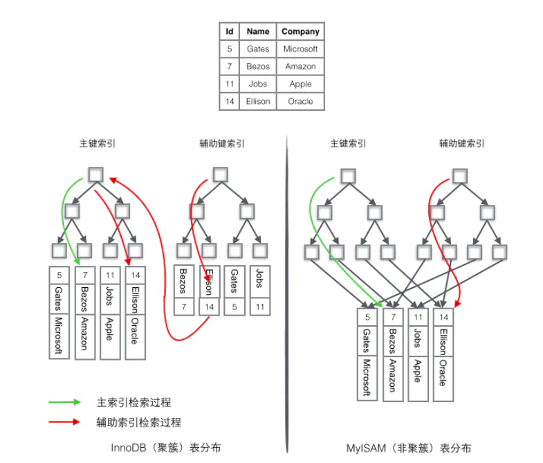

# SQL索引详解

SQL索引在数据库优化中占有一个非常大的比例， 一个好的索引的设计，可以让你的效率提高几十甚至几百倍，在这里将带你一步步揭开他的神秘面纱。
## 什么是索引
索引是定义在table基础之上，有助于无需检查所有记录而快速定位所需记录的一种辅助存储结构，由一系列存储在磁盘上的索引项组成，每一种索引项由索引字段和行指针构成。

数据库索引,是数据库管理系统中一个排序的数据结构,以协助快速查询,更新数据库中表的数据.索引的实现通常使用B树和变种的B+树(mysql常用的索引就是B+树)

除了数据之外,数据库系统还维护为满足特定查找算法的数据结构,这些数据结构以某种方式引用数据.这种数据结构就是索引

## 创建索引的好处
1. 通过创建索引,可以在查询的过程中,提高系统的性能
2. 通过创建唯一性索引,可以保证数据库表中每一行数据的唯一性
3. 在使用分组和排序子句进行数据检索时,可以减少查询中分组和排序的时间

## 创建索引的坏处
1. 创建索引和维护索引要耗费时间,而且时间随着数据量的增加而增大
2. 索引需要占用物理空间,如果要建立聚簇索引,所需要的空间会更大
3. 在对表中的数据进行增加删除和修改时需要耗费较多的时间,因为索引也要动态地维护

## 应该在哪些列上创建索引
1. 经常需要搜索的列上
2. 作为主键的列上
3. 经常用在连接的列上,这些列主要是一些外键,可以加快连接的速度
4. 经常需要根据范围进行搜索的列上
5. 经常需要排序的列上
6. 经常使用在where子句上面的列上

## 不应该在哪些列上创建索引
1. 查询中很少用到的列
2. 对于那些具有很少数据值的列.比如人事表的性别列,bit数据类型的列
3. 对于那些定义为text,image的列.因为这些列的数据量相当大
4. 当对修改性能的要求远远大于搜索性能时.因为当增加索引时,会提高搜索性能,但是会降低修改性能

## 索引的分类和使用
### 稠密索引和稀疏索引
- 稠密索引：对于主文件中每一个记录都对应一个索引项；
	候选键属性的稠密索引：先查索引，然后再依据索引读主文件；
	非候选键属性的稠密索引：
        主文件按索引字段排序，索引文件中的索引字段值无重复；
        主文件索引字段未排序，但索引文件中的索引字段值是有重复的；
        主文件索引字段未排序且索引文件中的索引字段值无重复，这时可以引入指针桶来处理；
- 稀疏索引：对于主文件中部分记录有索引项和它对应（要求主文件必须是按对应索引字段属性排序存储）；

### 主索引和辅助索引
- 主索引：对每个存储块有一个索引项，每个存储块的第一个记录叫锚，通常建立在有序文件的基于主码的排序字段上，属于稀疏索引。
- 辅助索引：是定义在主文件的任一或多个非排序字段上的辅助存储结构，属于稠密索引。
     补充：一个主文件可以有一个主索引，但可以有多个辅助索引。

### 聚簇索引和非聚簇索引
- 聚簇索引：将数据存储与索引放到了一块，找到索引也就找到了数据，主文件按照对应字段排序存储，索引文件无重复排序存储。
- 非聚簇索引：将数据存储于索引分开结构，索引结构的叶子节点指向了数据的对应行，主文件并没有按照对应字段排序存储，索引文件有重复排序存储。

按物理存储角度分聚集索引、非聚集索引
聚集索引
表记录的排列顺序和索引的排列顺序一致,所以查询效率快,只要找到第一个索引值记录,其余连续性的记录在物理上一样连续存放.聚集索引的缺点就是修改慢,因为为了使表记录和索引的排列顺序一致,在插入记录的时候,会对数据页重新排序
非聚集索引
表记录和索引的排列顺序不一定一致,两种索引都采用B+树的结构,非聚集索引的叶子层并不和实际数据页相重叠,而采用叶子层包含一个指向表记录的指针.非聚集索引层次多,不会造成数据重排
补充：
- 如果主文件的某一排序字段不是主码，则该字段上每个记录取值便不唯一，此时该字段被称为聚簇字段，聚簇索引通常是定义在聚簇字段上。
- 聚簇索引通常是对聚簇字段上每一个不同值有一个索引项。
- 一个主文件只能有一个聚簇索引文件，但可以有多个非聚簇索引文件。
- 主索引通常是聚簇索引，辅助索引通常是非聚簇索引。
- 主索引/聚簇索引是能够决定记录存储位置的索引，而非聚簇索引则只能用于查询，不能改变物理位置。

### 主键通常建议使用自增id
聚簇索引的数据的物理存放顺序与索引顺序是一致的，即：只要索引是相邻的，那么对应的数据一定也是相邻地存放在磁盘上的。如果主键不是自增id，那么可以想象，它会干些什么，不断地调整数据的物理地址、分页。
### mysql中聚簇索引的设定
聚簇索引默认是主键，如果表中没有定义主键，InnoDB 会选择一个唯一的非空索引代替。如果没有这样的索引，InnoDB 会隐式定义一个主键来作为聚簇索引。
### 倒排索引和正排索引
- 倒排索引：一个词汇包含在哪些文档中，倒排索引主要由两个部分组成：“单词词典”和“倒排文件”，应用于搜索引擎。
- 正排索引：一个文档包含了哪些词汇。
### 其他结构的索引
- 多级索引：对索引再建立索引，如B书/B+树等；
- 多属性索引：索引字段由多个属性组合一起形成的索引；
- 散列索引：使用散列技术组织的索引；
- 网络索引：使用多索引字段进行交叉联合定位与检索；
### 主键索引、普通索引、唯一索引、复合索引
主键索引：是一种特殊的索引，不允许有空值。一般在建表的时候同时创建主键索引
普通索引：最基本的索引，无任何限制
唯一索引：索引列的值必须唯一，允许有空值
- 主键一定是唯一索引。唯一索引不一定就是主键
- 一个表中可以有多个唯一索引，只能有一个主键
- 主键列不允许有空值，而唯一索引允许有空值
- 索引可以提高查询的效率

复合索引：又叫多列索引，联合索引，在多个字段上建立的索引，提高复合条件查询的效率

### 建立索引的原则
1. 定义主键的数据列一定要建立索引。
2. 定义有外键的数据列一定要建立索引。
3. 对于经常查询的数据列最好建立索引。
4. 对于需要在指定范围内的快速或频繁查询的数据列;
5. 经常用在WHERE子句中的数据列。
6. 经常出现在关键字order by、group by、distinct后面的字段，建立索引。如果建立的是复合索引，索引的字段顺序要和这些关键字后面的字段顺序一致，否则索引不会被使用。
7. 对于那些查询中很少涉及的列，重复值比较多的列不要建立索引。
8. 对于定义为text、image和bit的数据类型的列不要建立索引。
9. 对于经常存取的列避免建立索引 
10. 限制表上的索引数目。对一个存在大量更新操作的表，所建索引的数目一般不要超过3个，最多不要超过5个。索引虽说提高了访问速度，但太多索引会影响数据的更新操作。
11. 对复合索引，按照字段在查询条件中出现的频度建立索引。在复合索引中，记录首先按照第一个字段排序。对于在第一个字段上取值相同的记录，系统再按照第二个字段的取值排序，以此类推。因此只有复合索引的第一个字段出现在查询条件中，该索引才可能被使用,因此将应用频度高的字段，放置在复合索引的前面，会使系统最大可能地使用此索引，发挥索引的作用。

## 创建索引
### 创建索引的语法
CREATE \[UNIQUE][CLUSTERED | NONCLUSTERED]  INDEX  index_name  
ON {table_name | view_name} [WITH [index_property [,....n]]
说明：
UNIQUE: 建立唯一索引。
CLUSTERED: 建立聚集索引。
NONCLUSTERED: 建立非聚集索引。
Index_property: 索引属性。
UNIQUE索引既可以采用聚集索引结构，也可以采用非聚集索引的结构，如果不指明采用的索引结构，则SQL Server系统默认为采用非聚集索引结构。
### 删除索引语法
DROP INDEX table_name.index_name[,table_name.index_name]
说明：table_name: 索引所在的表名称。
index_name : 要删除的索引名称。
### 显示索引信息
使用系统存储过程：sp_helpindex 查看指定表的索引信息。
执行代码如下：
Exec sp_helpindex book1;

## 索引失效
1. 条件中用or（这就是为什么少用or的原因）
2. 对于多列（复合、联合）索引，不是使用的第一部分，则不会使用索引。(最左匹配原则或者叫做最左前缀原则），比如：Index_SoftWareDetail索引包含（a，b，c） 三列，但是查询条件里面，没有a，b 列，只有c 列，那么 Index_SoftWareDetail索引也不起作用。
3. like的模糊查询以%开头，索引失效
4. 如果列类型是字符串，那一定要在条件中将数据使用引号引用起来，否则不会使用索引
5. 如果MySQL预计使用全表扫描要比使用索引快，则不使用索引
6. 判断索引列是否不等于某个值时。‘!=’操作符。比如：select \* from SoftWareDetailInfo where SoftUseLine != 0
7. 对索引列进行运算。这里运算包括+-\*/等运算。也包括使用函数。比如：select \* from SoftWareDetailInfo where SoftUseLine +0= 0此时索引不起作用。select \* from SoftWareDetailInfo where count(SoftUseLine) = 0此时索引也不起作用。也就是说如果不是直接判断索引字段列，而是判断运算或其它函数处理后的索引列索引均不起作用。
8. 索引字段进行判空查询时。也就是对索引字段判断是否为NULL时。语句为is null 或is not null。比如：select \* from SoftWareDetailInfo where CreateTime is null 此时就不检索time字段上的索引表了。也就是索引在这条语句执行时失效了。接着再执行select \* from SoftWareDetailInfo where CreateTime = '2015-04-11 00:00:00' 此时就会检索索引表了。索引又起作用了.
9. 范围列可以用到索引（联合索引必须是最左前缀），但是范围列后面的列无法用到索引

## 索引的优化
1. 尽量不要使用左模糊和全模糊，如果需要可以使用搜索引擎来解决
2. union,in和or都可以命中索引，建议使用in
3. 负向条件查询不能使用索引，可以优化为in查询
	负向条件查询有：!=  <>  not in  not like等等
	例如：select \* from user where status!=1 and status!=2
	优化为：select \* from user where status in (0,3,4);
4. 合理使用联合索引的最左前缀原则
	如果在(a,b,c)三个字段上建立联合索引，那么它能够加快 a | (a,b) | (a,b,c) 三组查询速度。
	比如说把(username,password)建立了联合索引，因为业务上几乎没有password的单条件查询，而有很多username的单条件查询需求，所以应该建立(username,password)的联合索引，而不要建立(password,username)的联合索引
	- 建立联合索引的时候，要把查询频率较高的列放在最左边
	- 如果建立了(a,b)索引，就不必再独立建立a索引。同理如果建立了(a,b,c)联合索引，就不必再独立建立a,(a,b)索引
	- 存在非等号和等号混合判断条件时，在建索引时，请把等号条件的列前置。如     where a>? and b=?，那么即使 a 的区分度更高，也必须把 b 放在索引的最前列。
	- 最左前缀原则，并不是要求where后的顺序和联合索引的一致。下面的 SQL 语句也可以命中 (login_name, passwd) 这个联合索引。
		selectuid, login_time from user where passwd=? andlogin_name=?
		但还是建议 where 后的顺序和联合索引一致，养成好习惯。
5. 把计算放到业务层而不是数据库层。（因为对索引列进行运算，不能命中索引）
6. 表数据比较少、更新十分频繁、数据区分度不高的字段上不宜建立索引。
	一般区分度在80%以上的时候就可以建立索引，区分度可以使用 count(distinct(列名))/count(\*) 来计算。
7. 强制类型转换会全表扫描
	例如：如果phone字段是varchar类型，则下面的sql不能命中索引
	select \* from user where phone = 18838003017
	可以优化为：select \* from user where phone = '18838003017'
8. 利用覆盖索引进行查询操作，避免回表
	select uid,login_time from user where username=? and password=?
	如果建立了(username,password,login_time)的联合索引,由于login_time已经建立在索引中了,被查询的username和password就不用去row上获取数据了,从而加速查询
9. 在order by和group by中要注意索引的有序性
	如果order by是组合索引的一部分,应该将该字段放在组合索引的最后
	例如:where a=? and b=? order by c ->可以建立联合索引(a,b,c)
	如果索引中有范围查找,则索引的有序性无法利用
	例如:where a>10 order by b ->索引(a,b)无法排序
10. 建立索引的列,不许为null
	单列索引不存 null 值，复合索引不存全为 null 的值，如果列允许为 null，可能会得到“不符合预期”的结果集，所以，请使用 not null 约束以及默认值。

## sql语句的优化
1. 能用到索引尽量用到索引.对索引的优化实际上就是sql语句的调优
2. 任何地方都不要使用 select \* from t ，用具体的字段列表代替“\*”，不要返回用不到的任何字段。
3. 尽量使用where,而不要使用having
4. 尽量使用多表查询,不要使用子查询
5. where后的and.or左右执行顺序是从右至左
	- 运算符为and时--尽量把为假的放在右边
	- 运算符为or时--尽量把为真的放在右边

## 索引实战
### 不合理的索引设计
例：表record有620000行，试看在不同的索引下，下面几个 SQL的运行情况：

1.在date上建有一非个群集索引
select count(\*) from record where date >'19991201' and date < '19991214'and amount >2000 (25秒)
select date ,sum(amount) from record group by date(55秒)
select count(\*) from record where date >'19990901' and place in ('BJ','SH') (27秒)
分析:
date上有大量的重复值，在非群集索引下，数据在物理上随机存放在数据页上，在范围查找时，必须执行一次表扫描才能找到这一范围内的全部行。

2.在date上的一个群集索引
select count(\*) from record where date >'19991201' and date < '19991214' and amount >2000 （14秒）
select date,sum(amount) from record group by date（28秒）
select count(\*) from record where date >'19990901' and place in ('BJ','SH')（14秒）
分析:在群集索引下，数据在物理上按顺序在数据页上，重复值也排列在一起，因而在范围查找时，可以先找到这个范围的起末点，且只在这个范围内扫描数据页，避免了大范围扫描，提高了查询速度。
3.在place，date，amount上的组合索引
select count(\*) from record where date >'19991201' and date < '19991214' and amount >2000 （26秒）
select date,sum(amount) from record group by date（27秒）
select count(\*) from record where date >'19990901' and place in ('BJ, 'SH')（< 1秒）
分析:这是一个不很合理的组合索引，因为它的前导列是place，第一和第二条SQL没有引用place，因此也没有利用上索引；第三个SQL使用了place，且引用的所有列都包含在组合索引中，形成了索引覆盖，所以它的速度是非常快的。
4.在date，place，amount上的组合索引
select count(\*) from record where date >'19991201' and date < '19991214' and amount >2000(< 1秒)
select date,sum(amount) from record group by date（11秒）
select count(\*) from record where date >'19990901' and place in ('BJ','SH')（< 1秒）
分析:这是一个合理的组合索引。它将date作为前导列，使每个SQL都可以利用索引，并且在第一和第三个SQL中形成了索引覆盖，因而性能达到了最优。
5.总结
缺省情况下建立的索引是非群集索引，但有时它并不是最佳的；合理的索引设计要建立在对各种查询的分析和预测上。
一般来说：
1. 有大量重复值、且经常有范围查询（between, >,< ，>=,< =）和order by、group by发生的列，可考虑建立群集索引；
2. 经常同时存取多列，且每列都含有重复值可考虑建立组合索引；
3. 组合索引要尽量使关键查询形成索引覆盖，其前导列一定是使用最频繁的列。

### 不充份的连接条件
例：表card有7896行，在card_no上有一个非聚集索引，表account有191122行，在account_no上有一个非聚集索引，试看在不同的表连接条件下，两个SQL的执行情况：
select sum(a.amount) from account a,card b where a.card_no = b.card_no（20秒）
select sum(a.amount) from account a,card b where a.card_no = b.card_no and a.account_no=b.account_no（< 1秒）
分析：在第一个连接条件下，最佳查询方案是将account作外层表，card作内层表，利用card上的索引，其I/O次数可由以下公式估算为：
外层表account上的22541页+（外层表account的191122行\*内层表card上对应外层表第一行所要查找的3页）=595907次I/O\
在第二个连接条件下，最佳查询方案是将card作外层表，account作内层表，利用account上的索引，其I/O次数可由以下公式估算为：外层表card上的1944页+（外层表card的7896行\*内层表account上对应外层表每一行所要查找的4页）= 33528次I/O
可见，只有充份的连接条件，真正的最佳方案才会被执行。
总结：
1. 多表操作在被实际执行前，查询优化器会根据连接条件，列出几组可能的连接方案并从中找出系统开销最小的最佳方案。连接条件要充份考虑带有索引的表、行数多的表；内外表的选择可由公式：外层表中的匹配行数\*内层表中每一次查找的次数确定，乘积最小为最佳方案。
2. 查看执行方案的方法-- 用set showplanon，打开showplan选项，就可以看到连接顺序、使用何种索引的信息；想看更详细的信息，需用sa角色执行dbcc(3604,310,302)。
### 不可优化的where子句
1.例：下列SQL条件语句中的列都建有恰当的索引，但执行速度却非常慢：
select \* from record wheresubstring(card_no,1,4)='5378'(13秒)
select \* from record whereamount/30< 1000（11秒）
select \* from record whereconvert(char(10),date,112)='19991201'（10秒）
分析:where子句中对列的任何操作结果都是在SQL运行时逐列计算得到的，因此它不得不进行表搜索，而没有使用该列上面的索引；
如果这些结果在查询编译时就能得到，那么就可以被SQL优化器优化，使用索引，避免表搜索，因此将SQL重写成下面这样：
select \* from record where card_no like'5378%'（< 1秒）
select \* from record where amount< 1000\*30（< 1秒）
select \* from record where date= '1999/12/01'（< 1秒）
你会发现SQL明显快起来！
2.例：表stuff有200000行，id_no上有非群集索引，请看下面这个SQL：
select count(\*) from stuff where id_no in('0','1')（23秒）
分析: where条件中的'in'在逻辑上相当于'or'，所以语法分析器会将in ('0','1')转化为id_no ='0' or id_no='1'来执行。
我们期望它会根据每个or子句分别查找，再将结果相加，这样可以利用id_no上的索引；
但实际上（根据showplan）,它却采用了"OR策略"，即先取出满足每个or子句的行，存入临时数据库的工作表中，再建立唯一索引以去掉重复行，最后从这个临时表中计算结果。因此，实际过程没有利用id_no上索引，并且完成时间还要受tempdb数据库性能的影响。
实践证明，表的行数越多，工作表的性能就越差，当stuff有620000行时，执行时间竟达到220秒！还不如将or子句分开：
select count(\*) from stuff where id_no='0'select count(\*) from stuff where id_no='1'
得到两个结果，再作一次加法合算。因为每句都使用了索引，执行时间只有3秒，在620000行下，时间也只有4秒。
或者，用更好的方法，写一个简单的存储过程：
create proc count_stuff asdeclare @a intdeclare @b intdeclare @c intdeclare @d char(10)beginselect @a=count(\*) from stuff where id_no='0'select @b=count(\*) from stuff where id_no='1'endselect @c=@a+@bselect @d=convert(char(10),@c)print @d
直接算出结果，执行时间同上面一样快！
总结:可见，所谓优化即where子句利用了索引，不可优化即发生了表扫描或额外开销。

1. 任何对列的操作都将导致表扫描，它包括数据库函数、计算表达式等等，查询时要尽可能将操作移至等号右边。
2. in、or子句常会使用工作表，使索引失效；如果不产生大量重复值，可以考虑把子句拆开；拆开的子句中应该包含索引。
3. 要善于使用存储过程，它使SQL变得更加灵活和高效。
从以上这些例子可以看出，SQL优化的实质就是在结果正确的前提下，用优化器可以识别的语句，充份利用索引，减少表扫描的I/O次数，尽量避免表搜索的发生。其实SQL的性能优化是一个复杂的过程，上述这些只是在应用层次的一种体现，深入研究还会涉及数据库层的资源配置、网络层的流量控制以及操作系统层的总体设计。