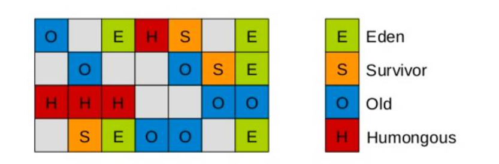
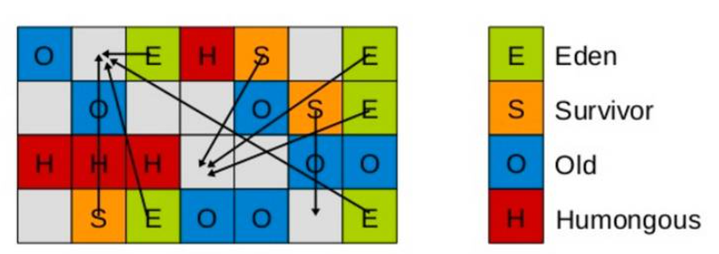
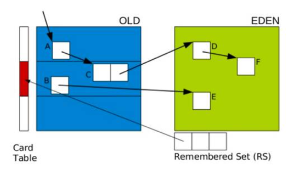
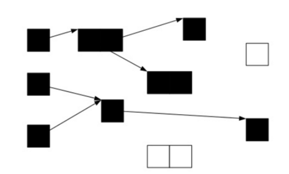
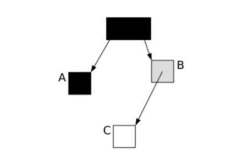
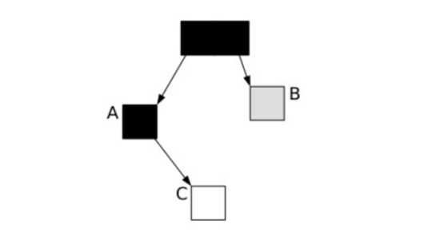
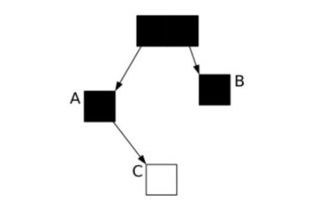
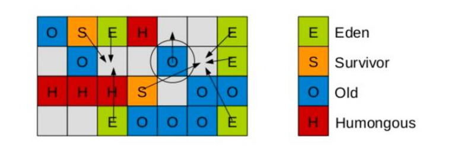
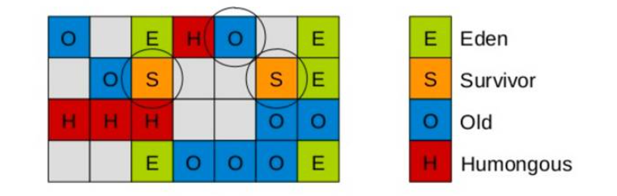

# UseG1GC垃圾回收技术解析

## 介绍

G1 GC，全称Garbage-First Garbage Collector，通过-XX:+UseG1GC参数来启用。G1收集器是工作在堆内不同分区上的收集器，分区既可以是年轻代也可以是老年代，同一个代的分区不需要连续。并且每个代分区的数量是可以动态调整的。为老年代设置分区的目的是老年代里有的分区垃圾多，有的分区垃圾少，这样在回收的时候可以专注于收集垃圾多的分区，这也是G1名称的由来。不过这个算法并不适合新生代垃圾收集，因为新生代的垃圾收集算法是复制算法，但是新生代也使用了分区机制主要是因为便于代大小的调整。

G1 GC是设计用来取代CMS的，同CMS相比G1有以下优势：

1. 可预测的停顿模型
2. 避免了CMS的垃圾碎片
3. 超大堆的表现更出色

## G1关键概念

### Region

G1里面的Region的概念不同于传统的垃圾回收算法中的分区的概念。G1默认把堆内存分为1024个分区，后续垃圾收集的单位都是以Region为单位的。Region是实现G1算法的基础，每个Region的大小相等，通过-XX:G1HeapRegionSize参数可以设置Region的大小。如下图所示：



图中的E代表是Eden区，S代表Survivor，O代表Old区，H代表humongous表示巨型对象(大小超过Region空间一半的对象)。从图中可以看出各个区域逻辑上并不是连续的。并且一个Region在某一个时刻是Eden，在另一个时刻就可能属于老年代。G1在进行垃圾清理的时候就是将一个Region的对象拷贝到另外一个Region中。

如果一个对象占用的空间超过了分区容量50%以上，G1收集器就认为这是一个巨型对象。这些巨型对象，默认直接会被分配在年老代，但是如果它是一个短期存在的巨型对象，就会对垃圾收集器造成负面影响。为了解决这个问题，G1划分了一个Humongous区，它用来专门存放巨型对象。如果一个H区装不下一个巨型对象，那么G1会寻找连续的H分区来存储。为了能找到连续的H区，有时候不得不启动Full GC。

PS：在java 8中，持久代也移动到了普通的堆内存空间中，改为元空间。

### SATB

SATB的全称是Snapchat-At-The_Beginning。SATB是维持并发GC的一种手段。G1并发的基础就是SATB。SATB可以理解成在GC开始之前对堆内存里的对象做一次快照，此时活的对象就认为是活的，从而形成一个对象图。在GC收集的时候，新生代的对象也认为是活的对象，除此之外其他不可达的对象都认为是垃圾对象。

如何找到在GC的过程中分配的对象呢？每个region记录着两个top-at-mark-start（TAMS）指针，分别为prevTAMS和nextTAMS。在TAMS以上的对象就是新分配的，因而被视为隐式marked。通过这种方式我们就找到了在GC过程中新分配的对象，并把这些对象认为是活的对象。

解决了对象在GC过程中分配的问题，那么在GC过程中引用发生变化的问题怎么解决呢， G1给出的解决办法是通过Write Barrier。Write Barrier就是对引用字段进行赋值做了环切。通过Write Barrier就可以了解到哪些引用对象发生了什么样的变化。

### RSet

RSet全称是Remember Set，每个Region中都有一个RSet，记录的是其他Region中的对象引用本Region对象的关系(谁引用了我的对象)。G1里面还有另外一种数据结构就Collection Set(CSet)，CSet记录的是GC要收集的Region的集合，CSet里的Region可以是任意代的。在GC的时候，对于old->young和old->old的跨代对象引用，只要扫描对应的CSet中的RSet即可。

### 停顿预测模型

G1收集器突出表现出来的一点是通过一个停顿预测模型来根据用户配置的停顿时间来选择CSet的大小，从而达到用户期待的应用程序暂停时间。通过-XX:MaxGCPauseMillis参数来设置。这一点有点类似于ParallelScavenge收集器。关于停顿时间的设置并不是越短越好。设置的时间越短意味着每次收集的CSet越小，导致垃圾逐步积累变多，最终不得不退化成Serial GC；停顿时间设置的过长，那么会导致每次都会产生长时间的停顿，影响了程序对外的响应时间。

### G1回收的过程

G1垃圾回收分为两个阶段：

1. 全局并发标记阶段(Global Concurrent marking)
2. 拷贝存活对象阶段(evacuation)

#### 全局并发标记阶段
全局并发标记阶段是基于SATB的，与CMS有些类似，但是也有不同的地方，主要的几个阶段如下：

初始标记：该阶段会STW。扫描根集合，将所有通过根集合直达的对象压入扫描栈，等待后续的处理。在G1中初始标记阶段是借助Young GC的暂停进行的，不需要额外的暂停。虽然加长了Young GC的暂停时间，但是从总体上来说还是提高的GC的效率。

并发标记：该阶段不需要STW。这个阶段不断的从扫描栈中取出对象进行扫描，将扫描到的对象的字段再压入扫描栈中，依次递归，直到扫描栈为空，也就是说trace了所有GCRoot直达的对象。同时这个阶段还会扫描SATB write barrier所记录下的引用。

最终标记：也叫Remark，这个阶段也是STW的。这个阶段会处理在并发标记阶段write barrier记录下的引用，同时进行弱引用的处理。这个阶段与CMS的最大的区别是CMS在这个阶段会扫描整个根集合，Eden也会作为根集合的一部分被扫描，因此耗时可能会很长。

清理： 该阶段会STW。清点和重置标记状态。这个阶段有点像mark-sweep中的sweep阶段，这个阶段并不会实际上去做垃圾的收集，只是去根据停顿模型来预测出CSet，等待evacuation阶段来回收。

#### 拷贝存活对象阶段

Evacuation阶段是全暂停的。该阶段把一部分Region里的活对象拷贝到另一部分Region中，从而实现垃圾的回收清理。Evacuation阶段从第一阶段选出来的Region中筛选出任意多个Region作为垃圾收集的目标，这些要收集的Region叫CSet，通过RSet实现。

筛选出CSet之后，G1将并行的将这些Region里的存活对象拷贝到其他Region中，这点类似于ParalledScavenge的拷贝过程，整个过程是完全暂停的。关于停顿时间的控制，就是通过选择CSet的数量来达到控制时间长短的目标。

### G1的收集模式：

YoungGC：收集年轻代里的Region
MixGC：年轻代的所有Region+全局并发标记阶段选出的收益高的Region
无论是YoungGC还是MixGC都只是并发拷贝的阶段。

分代G1模式下选择CSet有两种子模式，分别对应YoungGC和mixedGC：
YoungGC：CSet就是所有年轻代里面的Region
MixedGC：CSet是所有年轻代里的Region加上在全局并发标记阶段标记出来的收益高的Region

G1的运行过程是这样的，会在Young GC和Mix GC之间不断的切换运行，同时定期的做全局并发标记，在实在赶不上回收速度的情况下使用Full GC(Serial GC)。初始标记是搭在YoungGC上执行的，在进行全局并发标记的时候不会做Mix GC，在做Mix GC的时候也不会启动初始标记阶段。当MixGC赶不上对象产生的速度的时候就退化成Full GC，这一点是需要重点调优的地方。

#### G1 Young GC
Young GC主要是对Eden区进行GC，它在Eden空间耗尽时会被触发。在这种情况下，Eden空间的数据移动到Survivor空间中，如果Survivor空间不够，Eden空间的部分数据会直接晋升到年老代空间。Survivor区的数据移动到新的Survivor区中，也有部分数据晋升到老年代空间中。最终Eden空间的数据为空，GC停止工作，应用线程继续执行。



这时，我们需要考虑一个问题，如果仅仅GC 新生代对象，我们如何找到所有的根对象呢？ 老年代的所有对象都是根么？那这样扫描下来会耗费大量的时间。于是，G1引进了RSet的概念。它的全称是Remembered Set，作用是跟踪指向某个heap区内的对象引用。



在CMS中，也有RSet的概念，在老年代中有一块区域用来记录指向新生代的引用。这是一种point-out，在进行Young GC时，扫描根时，仅仅需要扫描这一块区域，而不需要扫描整个老年代。

但在G1中，并没有使用point-out，这是由于一个分区太小，分区数量太多，如果是用point-out的话，会造成大量的扫描浪费，有些根本不需要GC的分区引用也扫描了。于是G1中使用point-in来解决。point-in的意思是哪些分区引用了当前分区中的对象。这样，仅仅将这些对象当做根来扫描就避免了无效的扫描。由于新生代有多个，那么我们需要在新生代之间记录引用吗？这是不必要的，原因在于每次GC时，所有新生代都会被扫描，所以只需要记录老年代到新生代之间的引用即可。

需要注意的是，如果引用的对象很多，赋值器需要对每个引用做处理，赋值器开销会很大，为了解决赋值器开销这个问题，在G1 中又引入了另外一个概念，卡表(Card Table)。一个Card Table将一个分区在逻辑上划分为固定大小的连续区域，每个区域称之为卡。卡通常较小，介于128到512字节之间。Card Table通常为字节数组，由Card的索引(即数组下标)来标识每个分区的空间地址。默认情况下，每个卡都未被引用。当一个地址空间被引用时，这个地址空间对应的数组索引的值被标记为”0″，即标记为脏被引用，此外RSet也将这个数组下标记录下来。一般情况下，这个RSet其实是一个Hash Table，Key是别的Region的起始地址，Value是一个集合，里面的元素是Card Table的Index。

Young GC 阶段：

- 阶段1：根扫描,静态和本地对象被扫描
- 阶段2：更新RS,处理dirty card队列更新RS
- 阶段3：处理RS,检测从年轻代指向年老代的对象
- 阶段4：对象拷贝,拷贝存活的对象到survivor/old区域
- 阶段5：处理引用队列,软引用，弱引用，虚引用处理

#### G1 Mix GC

Mix GC不仅进行正常的新生代垃圾收集，同时也回收部分后台扫描线程标记的老年代分区。
它的GC步骤分2步：

- 全局并发标记(global concurrent marking)
- 拷贝存活对象(evacuation)

在进行Mix GC之前，会先进行global concurrent marking(全局并发标记)。 global concurrent marking的执行过程是怎样的呢？

在G1 GC中，它主要是为Mixed GC提供标记服务的，并不是一次GC过程的一个必须环节。global concurrent marking的执行过程分为五个步骤：

##### 初始标记(initial mark，STW)

在此阶段，G1 GC 对根进行标记。该阶段与常规的 (STW) 年轻代垃圾回收密切相关。

##### 根区域扫描(root region scan)

G1 GC 在初始标记的存活区扫描对老年代的引用，并标记被引用的对象。该阶段与应用程序(非 STW)同时运行，并且只有完成该阶段后，才能开始下一次 STW 年轻代垃圾回收。

##### 并发标记(Concurrent Marking)

G1 GC 在整个堆中查找可访问的(存活的)对象。该阶段与应用程序同时运行，可以被 STW 年轻代垃圾回收中断

##### 最终标记(Remark，STW)

该阶段是 STW 回收，帮助完成标记周期。G1 GC 清空 SATB 缓冲区，跟踪未被访问的存活对象，并执行引用处理。

##### 清除垃圾(Cleanup，STW)

在这个最后阶段，G1 GC 执行统计和 RSet 净化的 STW 操作。在统计期间，G1 GC 会识别完全空闲的区域和可供进行混合垃圾回收的区域。清理阶段在将空白区域重置并返回到空闲列表时为部分并发。

##### 三色标记算法

提到并发标记，我们不得不了解并发标记的三色标记算法。它是描述追踪式回收器的一种有用的方法，利用它可以推演回收器的正确性。 首先，我们将对象分成三种类型的。

- 黑色:根对象，或者该对象与它的子对象都被扫描
- 灰色:对象本身被扫描,但还没扫描完该对象中的子对象
- 白色:未被扫描对象，扫描完成所有对象之后，最终为白色的为不可达对象，即垃圾对象

当GC开始扫描对象时，按照如下图步骤进行对象的扫描：
根对象被置为黑色，子对象被置为灰色。
继续由灰色遍历,将已扫描了子对象的对象置为黑色。
遍历了所有可达的对象后，所有可达的对象都变成了黑色。不可达的对象即为白色，需要被清理。



这看起来很美好，但是如果在标记过程中，应用程序也在运行，那么对象的指针就有可能改变。这样的话，我们就会遇到一个问题：对象丢失问题.

我们看下面一种情况，当垃圾收集器扫描到下面情况时：



这时候应用程序执行了以下操作：
A.c=C
B.c=null
这样，对象的状态图变成如下情形：



这时候垃圾收集器再标记扫描的时候就会下图成这样：



很显然，此时C是白色，被认为是垃圾需要清理掉，显然这是不合理的。那么我们如何保证应用程序在运行的时候，GC标记的对象不丢失呢？有如下2中可行的方式：

- 在插入的时候记录对象
- 在删除的时候记录对象

刚好这对应CMS和G1的2种不同实现方式：

在CMS采用的是增量更新(Incremental update)，只要在写屏障(write barrier)里发现要有一个白对象的引用被赋值到一个黑对象 的字段里，那就把这个白对象变成灰色的。即插入的时候记录下来。

在G1中，使用的是STAB(snapshot-at-the-beginning)的方式，删除的时候记录所有的对象，它有3个步骤：

1. 在开始标记的时候生成一个快照图标记存活对象
2. 在并发标记的时候所有被改变的对象入队(在write barrier里把所有旧的引用所指向的对象都变成非白的)
3. 可能存在游离的垃圾，将在下次被收集

这样，G1到现在可以知道哪些老的分区可回收垃圾最多。 当全局并发标记完成后，在某个时刻，就开始了Mix GC。这些垃圾回收被称作“混合式”是因为他们不仅仅进行正常的新生代垃圾收集，同时也回收部分后台扫描线程标记的分区。混合式垃圾收集如下图：



混合式GC也是采用的复制的清理策略，当GC完成后，会重新释放空间。



## G1最佳实践

在使用G1垃圾收集器的时候遵循以下实践可以少走不少弯路：

### 不断调优暂停时间指标

通过XX:MaxGCPauseMillis=x可以设置启动应用程序暂停的时间，G1在运行的时候会根据这个参数选择CSet来满足响应时间的设置。一般情况下这个值设置到100ms或者200ms都是可以的(不同情况下会不一样)，但如果设置成50ms就不太合理。暂停时间设置的太短，就会导致出现G1跟不上垃圾产生的速度。最终退化成Full GC。所以对这个参数的调优是一个持续的过程，逐步调整到最佳状态。

### 不要设置新生代和老年代的大小

G1收集器在运行的时候会调整新生代和老年代的大小。通过改变代的大小来调整对象晋升的速度以及晋升年龄，从而达到我们为收集器设置的暂停时间目标。设置了新生代大小相当于放弃了G1为我们做的自动调优。我们需要做的只是设置整个堆内存的大小，剩下的交给G1自己去分配各个代的大小。

### 关注Evacuation Failure

Evacuation Failure类似于CMS里面的晋升失败，堆空间的垃圾太多导致无法完成Region之间的拷贝，于是不得不退化成Full GC来做一次全局范围内的垃圾收集。

## G1常用参数
|参数/默认值|含义|
|------|--------|
|	-XX:+UseG1GC	|	使用 G1 垃圾收集器	|
|	-XX:MaxGCPauseMillis=200	|	设置期望达到的最大GC停顿时间指标（JVM会尽力实现，但不保证达到）	|
|	-XX:InitiatingHeapOccupancyPercent=45	|	启动并发GC周期时的堆内存占用百分比. G1之类的垃圾收集器用它来触发并发GC周期,基于整个堆的使用率,而不只是某一代内存的使用比. 值为 0 则表示”一直执行GC循环”. 默认值为 45.	|
|	-XX:NewRatio=n	|	新生代与老生代(new/old generation)的大小比例(Ratio). 默认值为 2.	|
|	-XX:SurvivorRatio=n	|	eden/survivor 空间大小的比例(Ratio). 默认值为 8.	|
|	-XX:MaxTenuringThreshold=n	|	提升年老代的最大临界值(tenuring threshold). 默认值为 15.	|
|	-XX:ParallelGCThreads=n	|	设置垃圾收集器在并行阶段使用的线程数,默认值随JVM运行的平台不同而不同.	|
|	-XX:ConcGCThreads=n	|	并发垃圾收集器使用的线程数量. 默认值随JVM运行的平台不同而不同.	|
|	-XX:G1ReservePercent=n	|	设置堆内存保留为假天花板的总量,以降低提升失败的可能性. 默认值是 10.	|
|	-XX:G1HeapRegionSize=n	|	使用G1时Java堆会被分为大小统一的的区(region)。此参数可以指定每个heap区的大小. 默认值将根据 heap size 算出最优解. 最小值为 1Mb, 最大值为 32Mb.	|

## G1日志分析
```shell
//新生代GC
2018-05-03T10:21:43.209-0800: [GC pause (G1 Humongous Allocation) (young) (initial-mark), 0.0035356 secs]  //初始标记，耗时0.0035秒
   [Parallel Time: 2.4 ms, GC Workers: 8]  //并行8个线程，耗时2.4ms
      [GC Worker Start (ms): Min: 813.1, Avg: 813.7, Max: 813.9, Diff: 0.7]
      [Ext Root Scanning (ms): Min: 0.0, Avg: 1.1, Max: 1.5, Diff: 1.5, Sum: 9.1]   //每个扫描root的线程耗时
      [Update RS (ms): Min: 0.0, Avg: 0.0, Max: 0.0, Diff: 0.0, Sum: 0.0]   //更新RS的耗时，G1中每块区域都有一个RS与之对应，RS记录了该区域被其他区域引用的对象。回收时，就把RS作为根集的一部分，从而加快回收
         [Processed Buffers: Min: 0, Avg: 0.0, Max: 0, Diff: 0, Sum: 0]  //Processed Buffers就是记录引用变化的缓存空间
      [Scan RS (ms): Min: 0.0, Avg: 0.0, Max: 0.0, Diff: 0.0, Sum: 0.0]   //扫描RS
      [Code Root Scanning (ms): Min: 0.0, Avg: 0.0, Max: 0.0, Diff: 0.0, Sum: 0.0]  //根扫描耗时
      [Object Copy (ms): Min: 0.0, Avg: 0.5, Max: 1.3, Diff: 1.3, Sum: 3.6] //对象拷贝
      [Termination (ms): Min: 0.0, Avg: 0.2, Max: 0.2, Diff: 0.2, Sum: 1.2]   
         [Termination Attempts: Min: 1, Avg: 1.8, Max: 4, Diff: 3, Sum: 14]
      [GC Worker Other (ms): Min: 0.0, Avg: 0.0, Max: 0.0, Diff: 0.0, Sum: 0.1]
      [GC Worker Total (ms): Min: 1.6, Avg: 1.8, Max: 2.3, Diff: 0.8, Sum: 14.1]   //GC线程耗时
      [GC Worker End (ms): Min: 815.4, Avg: 815.4, Max: 815.4, Diff: 0.0]
   [Code Root Fixup: 0.0 ms]
   [Code Root Purge: 0.0 ms]
   [Clear CT: 0.1 ms]   //清空CardTable耗时，RS是依赖CardTable记录区域存活对象的
   [Other: 1.1 ms]
      [Choose CSet: 0.0 ms]   //选取CSet
      [Ref Proc: 0.9 ms]  //弱引用、软引用的处理耗时
      [Ref Enq: 0.0 ms]   //弱引用、软引用的入队耗时
      [Redirty Cards: 0.1 ms]
      [Humongous Register: 0.0 ms]
      [Humongous Reclaim: 0.0 ms]
      [Free CSet: 0.0 ms]   //释放被回收区域的耗时（包含他们的RS）
   [Eden: 5120.0K(24.0M)->0.0B(12.0M) Survivors: 0.0B->2048.0K Heap: 16.0M(50.0M)->12.4M(50.0M)]
 [Times: user=0.01 sys=0.00, real=0.01 secs] 
 //根区域扫描
2018-05-03T10:21:43.213-0800: [GC concurrent-root-region-scan-start]
2018-05-03T10:21:43.214-0800: [GC concurrent-root-region-scan-end, 0.0012422 secs]
// 并发标记
2018-05-03T10:21:43.214-0800: [GC concurrent-mark-start]
2018-05-03T10:21:43.214-0800: [GC concurrent-mark-end, 0.0004063 secs]
//重新标记又叫最终标记
2018-05-03T10:21:43.214-0800: [GC remark 2018-05-03T10:21:43.215-0800: [Finalize Marking, 0.0003736 secs] 2018-05-03T10:21:43.215-0800: [GC ref-proc, 0.0000533 secs] 2018-05-03T10:21:43.215-0800: [Unloading, 0.0007439 secs], 0.0013442 secs]
 [Times: user=0.00 sys=0.00, real=0.00 secs] 
 //独占清理
2018-05-03T10:21:43.216-0800: [GC cleanup 13M->13M(50M), 0.0004002 secs]
 [Times: user=0.01 sys=0.00, real=0.00 secs]
```

## 调优实践
### MaxGCPauseMillis调优

前面介绍过使用GC的最基本的参数：

-XX:+UseG1GC -Xmx32g -XX:MaxGCPauseMillis=200

前面2个参数都好理解，后面这个MaxGCPauseMillis参数该怎么配置呢？这个参数从字面的意思上看，就是允许的GC最大的暂停时间。G1尽量确保每次GC暂停的时间都在设置的MaxGCPauseMillis范围内。 那G1是如何做到最大暂停时间的呢？这涉及到另一个概念，CSet(collection set)。它的意思是在一次垃圾收集器中被收集的区域集合。

Young GC：选定所有新生代里的region。通过控制新生代的region个数来控制young GC的开销。

Mixed GC：选定所有新生代里的region，外加根据global concurrent marking统计得出收集收益高的若干老年代region。在用户指定的开销目标范围内尽可能选择收益高的老年代region。

在理解了这些后，我们再设置最大暂停时间就好办了。 首先，我们能容忍的最大暂停时间是有一个限度的，我们需要在这个限度范围内设置。但是应该设置的值是多少呢？我们需要在吞吐量跟MaxGCPauseMillis之间做一个平衡。如果MaxGCPauseMillis设置的过小，那么GC就会频繁，吞吐量就会下降。如果MaxGCPauseMillis设置的过大，应用程序暂停时间就会变长。G1的默认暂停时间是200毫秒，我们可以从这里入手，调整合适的时间。

### 其他调优参数

-XX:G1HeapRegionSize=n

设置的 G1 区域的大小。值是 2 的幂，范围是 1 MB 到 32 MB 之间。目标是根据最小的 Java 堆大小划分出约 2048 个区域。

-XX:ParallelGCThreads=n

设置 STW 工作线程数的值。将 n 的值设置为逻辑处理器的数量。n 的值与逻辑处理器的数量相同，最多为 8。

如果逻辑处理器不止八个，则将 n 的值设置为逻辑处理器数的 5/8 左右。这适用于大多数情况，除非是较大的 SPARC 系统，其中 n 的值可以是逻辑处理器数的 5/16 左右。

-XX:ConcGCThreads=n

设置并行标记的线程数。将 n 设置为并行垃圾回收线程数 (ParallelGCThreads) 的 1/4 左右。

-XX:InitiatingHeapOccupancyPercent=45

设置触发标记周期的 Java 堆占用率阈值。默认占用率是整个 Java 堆的 45%。

避免使用以下参数：

避免使用 -Xmn 选项或 -XX:NewRatio 等其他相关选项显式设置年轻代大小。固定年轻代的大小会覆盖暂停时间目标。

触发Full GC

在某些情况下，G1触发了Full GC，这时G1会退化使用Serial收集器来完成垃圾的清理工作，它仅仅使用单线程来完成GC工作，GC暂停时间将达到秒级别的。整个应用处于假死状态，不能处理任何请求，我们的程序当然不希望看到这些。那么发生Full GC的情况有哪些呢？

并发模式失败

G1启动标记周期，但在Mix GC之前，老年代就被填满，这时候G1会放弃标记周期。这种情形下，需要增加堆大小，或者调整周期(例如增加线程数-XX:ConcGCThreads等)。

晋升失败或者疏散失败

G1在进行GC的时候没有足够的内存供存活对象或晋升对象使用，由此触发了Full GC。可以在日志中看到(to-space exhausted)或者(to-space overflow)。解决这种问题的方式是：

1. 增加 -XX:G1ReservePercent 选项的值(并相应增加总的堆大小)，为“目标空间”增加预留内存量。
2. 通过减少 -XX:InitiatingHeapOccupancyPercent 提前启动标记周期。
3. 也可以通过增加 -XX:ConcGCThreads 选项的值来增加并行标记线程的数目。

巨型对象分配失败

当巨型对象找不到合适的空间进行分配时，就会启动Full GC，来释放空间。这种情况下，应该避免分配大量的巨型对象，增加内存或者增大-XX:G1HeapRegionSize，使巨型对象不再是巨型对象。