# new Object到底占用几个字节

这个问题，需要我们来分析一下堆内布局以及Java对象在内存中的布局

## 对象的指向

先来看一段代码：

```java
package com.zwx.jvm;
public class HeapMemory {
    private Object obj1 = new Object();

    public static void main(String[] args) {
        Object obj2 = new Object();
    }
}
```

上面的代码中，obj1 和obj2在内存中有什么区别？

方法区存储每个类的结构，比如：运行时常量池、属性和方法数据，以及方法和构造函数等数据。所以我们这个obj1是存在方法区的，而new会创建一个对象实例，对象实例是存储在堆内的，于是就有了下面这幅图(**方法区指向堆**)：

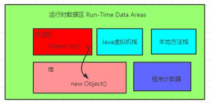

而obj2 是属于方法内的局部变量，存储在Java虚拟机栈内的栈帧中的局部变量表内，这就是经典的**栈指向堆**：

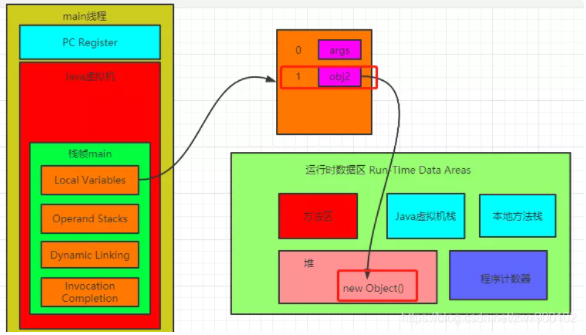

这里我们再来思考一下，我们一个变量指向了堆，而堆内只是存储了一个实例对象，那么堆内的示例对象是如何知道自己属于哪个Class，也就是说这个实例是如何知道自己所对应的类元信息的呢？这就涉及到了一个Java对象在内存中是如何布局的。

## Java内存模型

对象内存中可以分为三块区域：对象头(Header)，实例数据(Instance Data)和对齐填充(Padding)，**以64位操作系统为例(未开启指针压缩的情况)**Java对象布局如下图所示：

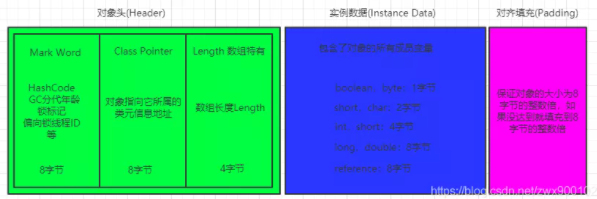

其中对象头中的Mark Word中的详细信息在文章synchronized锁升级原理中有详细介绍。上图中的对齐填充不是一定有的，如果对象头和实例数据加起来刚好是8字节的倍数，那么就不需要对齐填充。

知道了Java内存布局，那么我们来看一个面试问题

### Object obj=new Object()占用字节

这是网上很多人都会提到的一个问题，那么结合上面的Java内存布局，我们来分析下，以64位操作系统为例，new Object()占用大小分为两种情况：

- 未开启指针压缩     占用大小为：**8(Mark Word)+8(Class Pointer)=16字节**
- 开启了指针压缩(默认是开启的)     开启指针压缩后，Class Pointer会被压缩为4字节，最终大小为：**8(Mark Word)+4(Class Pointer)+4(对齐填充)=16字节**

结果到底是不是这个呢？我们来验证一下。首先引入一个pom依赖：

```xml
<dependency>
            <groupId>org.openjdk.jol</groupId>
            <artifactId>jol-core</artifactId>
            <version>0.10</version>
</dependency>
```

然后新建一个简单的demo：

```java
package com.zwx.jvm;
import org.openjdk.jol.info.ClassLayout;
public class HeapMemory {
    public static void main(String[] args) {
        Object obj = new Object();
        System.out.println(ClassLayout.parseInstance(obj).toPrintable());
    }
}
```

输出结果如下：

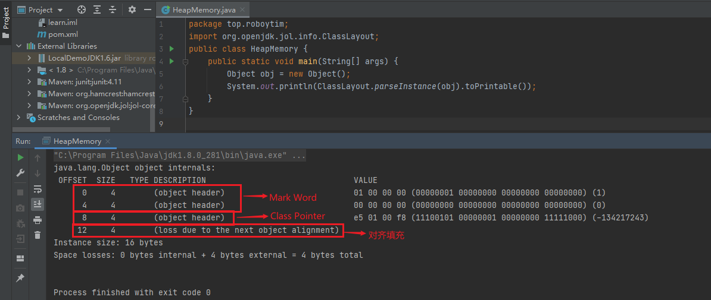

最后的结果是16字节，没有问题，这是因为默认开启了指针压缩，那我们现在把指针压缩关闭之后再去试试。

```shell
-XX:+UseCompressedOops  开启指针压缩
-XX:-UseCompressedOops  关闭指针压缩
```

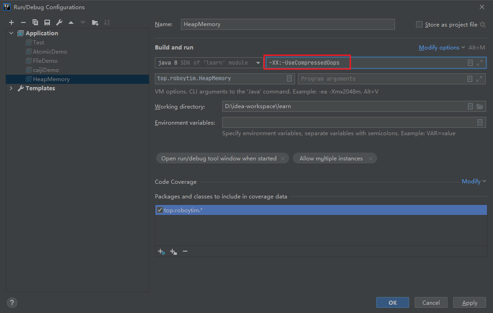

再次运行，得到如下结果：

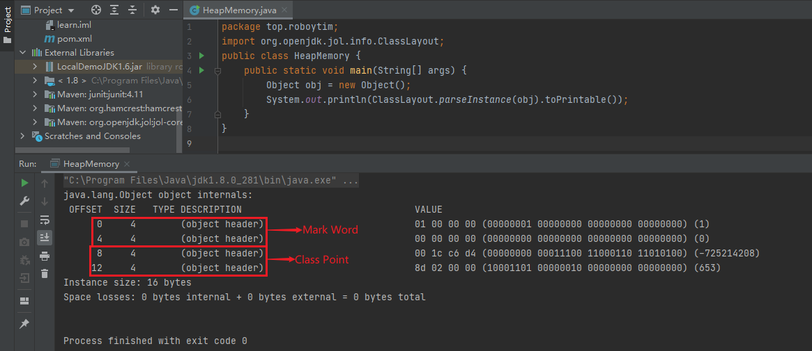

可以看到，这时候已经没有了对齐填充部分了，但是占用大小还是16位。

下面我们再来演示一下如果一个对象中带有属性之后的大小。

新建一个类，内部只有一个byte属性：

```java
package com.zwx.jvm;
public class MyItem {
    byte i = 0;
}
```

然后分别在开启指针压缩和关闭指针压缩的场景下分别输出这个类的大小。

```java
package com.zwx.jvm;
import org.openjdk.jol.info.ClassLayout;
public class HeapMemory {
    public static void main(String[] args) {
        MyItem myItem = new MyItem();
        System.out.println(ClassLayout.parseInstance(myItem).toPrintable());
    }
}
```

开启指针压缩,占用16字节：

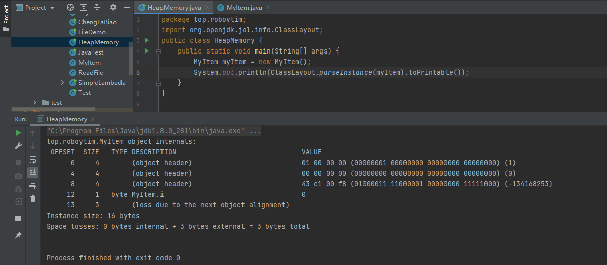

关闭指针压缩，占用24字节：

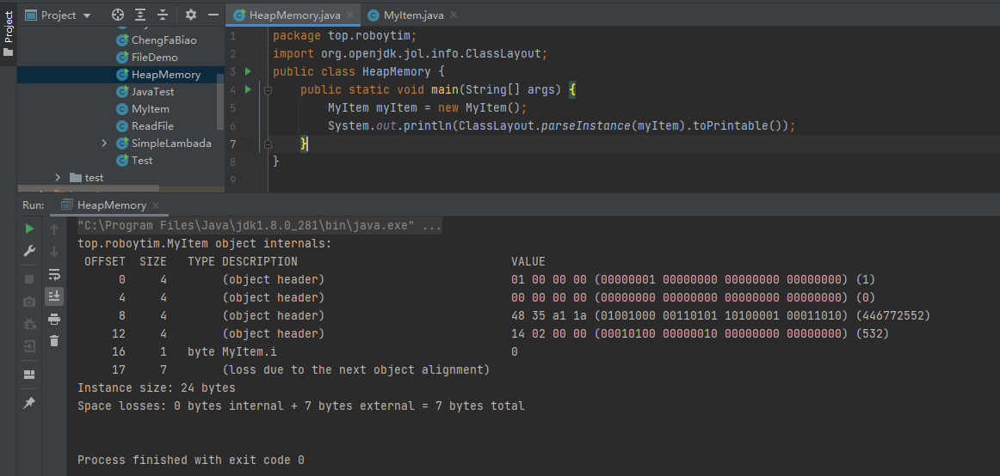

这个时候就能看出来开启了指针压缩的优势了，如果不断创建大量对象，指针压缩对性能还是有一定优化的。

## 对象的访问

创建好一个对象之后，当然需要去访问它，那么当我们需要访问一个对象的时候，是如何定位到对象的呢？目前最主流的访问对象方式有两种：**句柄访问**和**直接指针访问**。

- 句柄访问     使用句柄访问的话，Java虚拟机会在堆内划分出一块内存来存储句柄池，那么对象当中存储的就是句柄地址，然后句柄池中才会存储对象实例数据和对象类型数据地址。

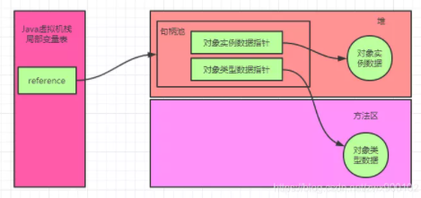

- 直接指针访问(Hot Spot虚拟机采用的方式)     直接指针访问的话对象中就会直接存储对象类型数据。

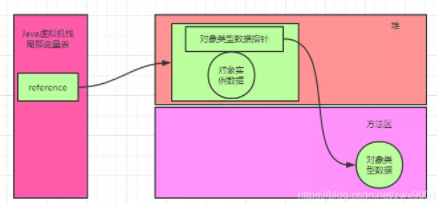

### 句柄访问和直接指针访问对比

上面图形中我们很容易对比，就是如果使用句柄访问的时候，会多了一次指针定位，但是他也有一个好处就是，假如一个对象被移动(地址改变了)，那么只需要改变句柄池的指向就可以了，不需要修改reference对象内的指向，而如果使用直接指针访问，就还需要到局部变量表内修改reference指向。

## 堆内存

上面我们提到，在Java对象头当中的Mark Word存储了对象的分代年龄，那么什么是分代年龄呢？

一个对象的分代年龄可以理解为垃圾回收次数，当一个对象经过一次垃圾回收之后还存在，那么分代年龄就会加1，在64位的虚拟机中，分代年龄占了4位，最大值为15。分代年龄默认为0000，随着垃圾回收次数，会逐渐递增。

Java堆内存中按照分代年龄来划分，分为Young区和Old区，对象分配首先会到Young区，达到一定分代年龄(-XX:MaxTenuringThreshold可以设置大小，默认为15)就会进入Old区(**注意：如果一个对象太大，那么就会直接进入Old区**)。

之所以会这么划分是因为如果整个堆只有一个区的话，那么垃圾回收的时候每次都需要把堆内所有对象都扫描一遍，浪费性能。而其实大部分Java对象的生命周期都是很短的，一旦一个对象回收很多次都回收不掉，可以认为下一次垃圾回收的时候可能也回收不掉，所以Young区和Old区的垃圾回收可以分开进行，只有当Young区在进行垃圾回收之后还是没有腾出空间，那么再去触发Old区的垃圾回收。

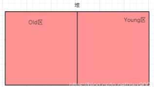

### Young区

现在拆分成了Young区，那我们看下面一个场景，下面的Young是经过垃圾回收之后的一个概图：

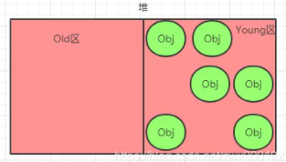

假如说现在来了一个对象，要占用2个对象的大小，会发现放不下去了，这时候就会触发GC(垃圾回收)，但是一旦触发了GC(垃圾回收)，对用户线程是有影响的，因为GC过程中为了确保对象引用不会不断变化，需要停止所有用户线程，Sun把这个事件称之为：Stop the World(STW)。这些在下一篇讲解垃圾回收的时候会详细介绍，这里先不深入。

所以说一般是越少GC越好，而实际上上图中可以看到至少还可以放入3个对象，只要按照对象都按照顺序放好，那么是可以放得下的，所以这就产生了问题了，**明明有空间，但是因为空间不连续，导致对象申请内存失败，导致触发GC**了，那么如何解决这种问题呢？

解决的思路就是把Young区的对象按顺序放好，所以就产生了一个方法，把Young区再次划分一下，分为2个区：**Eden区**和**Survivor区**。

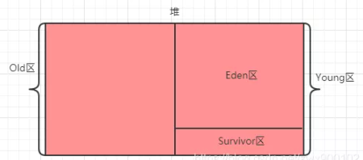

具体操作是：一个对象来了之后，先分配到Eden区，Eden区满了之后，触发GC，经过GC之后，为了防止空间不连续，把幸存下来的对象复制到Survivor区，然后Eden区就可以完整清理掉了，当然这么做是有一个前提的，**就是大部分对象都是生命周期极短的，基本一次垃圾回收就可以把Eden区大部分对象回收掉**（这个前提是经过测试总结得到的）。

触发GC的时候Survivor区也会一起回收，并不是说单独只触发Eden区，但是这样问题又来了，Eden区是保证空间基本连续了，但是Survivor区又可能产生空间碎片，导致不连续了，所以就又把Survivor区给一分为二了：

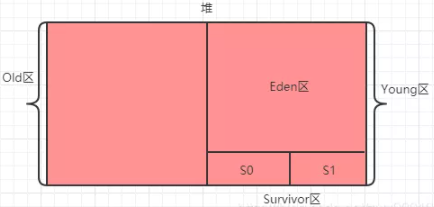

这个时候工作流程又变成这样了：首先还是在Eden区分配空间，Eden区满了之后触发GC，GC之后把幸存对象 复制到S0区(S1区是空的)，然后继续在Eden区分配对象，再次触发GC之后如果发现S0区放不下了(产生空间碎片，实际还有空间)，那么就把S0区对象复制到S1区，并把幸存对象也复制到S1区，这时候S0区是空的了，并依次反复操作，假如说S0区或者S1区空间对象复制移动了之后还是放不下，那就说明这时候是真的满了，那就去老年区借点空间过来（这就是**担保机制**，老年代需要提供这种空间分配担保），假如说老年区空间也不够了，那就会触发Full GC，如果还是不够，那就会抛出OutOfMemeoyError异常了。

注意：为了确保S0和S1两个区域之间每次复制都能顺利进行，S0和S1两个区的大小必须要保持一致，而且同一时间有一个区域一定是空的。虽然说这种做法是会导致了一小部分空间的浪费，但是综合其他性能的提升来说，是值得的。

### Old区

当Young区的对象达到设置的分代年龄之后，对象会进入Old区，Old区满了之后会触发Full GC，如果还是清理不掉空间，那么就抛出OutOfMemeoyError异常。

### 名词扫盲

上面提到了很多新的名词，而实际上很多这种名词还有其他叫法，这个还是觉得有必要了解一下。

- 垃圾回收：简称GC。
- Minor GC：针对新生代的GC
- Major GC：针对老年代的GC，一般老年代触发GC的同时也会触发Minor GC，也就等于触发了Full GC。
- Full GC：新生代+老年代同时发生GC。
- Young区：新生代
- Old区：老年代
- Eden区：暂时没发现有什么中文翻译(伊甸园?)
- Surcivor区：幸存区
- S0和S1：也称之为from区和to区，注意from和to两个区是不断互换身份的，且S0和S1一定要相等，并且保证一块区域是空的

### 一个对象的人生轨迹图

从上面的介绍大家应该有一个大致的印象，一个对象会在Eden区，S0区，S1区，Old区不断流转（当然，一开始就会被回收的短命对象除外），我们可以得到下面的一个流程图：

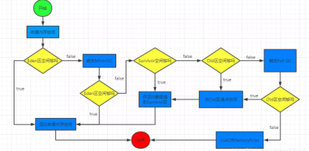

