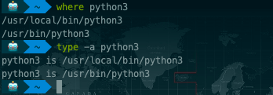
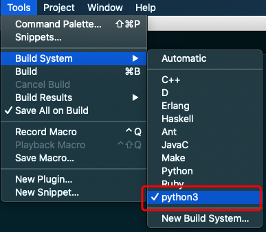

# Python3之sublime配置

起因：在windows中，用python3编写了一个简单的selenium脚本，在自己的mac上，使用sublime打开后，command+shift+B执行时，报错：

no moduel named ‘selenium’

由于mac上同时存在python2 和 python3 两个版本，于是执行pip3 install selenium，来安装python3的模块。

安装成功后，执行还是报同样的no moduel named ‘selenium’错误。

怀疑由于sublime默认使用python2环境。需要改为使用python3环境。

步骤：
## 1. 执行 where python3 或者 type -a python3，查询对应路径。



## 2. 修改sublime配置

打开sublime，选择Tools->Build System->New Build System，这时打开一个新的配置文件，删除所有内容后，输入如下内容：
```
{
    "cmd": ["/usr/local/bin/python3","-u","$file"]
}
```
*注意:这里的路径一定是上面通过上述命令查询出来的 Python3 路径。*

将这个配置文件命名为 python3.sublime-build，并保存到默认目录即可。

## 3. 重启sublime

Tools->Build System中选择刚才新建的python3后，使用command+shift+B执行即可。



附：
[download chromedriver](http://chromedriver.storage.googleapis.com/index.html)