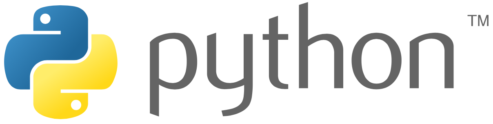

# Python

Python（英国发音：/ˈpaɪθən/ 美国发音：/ˈpaɪθɑːn/）是一种广泛使用的解释型、高级编程、通用型编程语言，由吉多·范罗苏姆创造，第一版发布于1991年。可以视之为一种改良（加入一些其他编程语言的优点，如面向对象）的LISP。Python的设计哲学强调代码的可读性和简洁的语法（尤其是使用空格缩进划分代码块，而非使用大括号或者关键词）。相比于C++或Java，Python让开发者能够用更少的代码表达想法。不管是小型还是大型程序，该语言都试图让程序的结构清晰明了。

与Scheme、Ruby、Perl、Tcl等动态类型编程语言一样，Python拥有动态类型系统和垃圾回收功能，能够自动管理内存使用，并且支持多种编程范式，包括面向对象、命令式、函数式和过程式编程。其本身拥有一个巨大而广泛的标准库。

Python 解释器本身几乎可以在所有的操作系统中运行。Python的其中一个解释器CPython是用C语言编写的、是一个由社群驱动的自由软件，当前由Python软件基金会管理。

[官网](https://www.python.org)